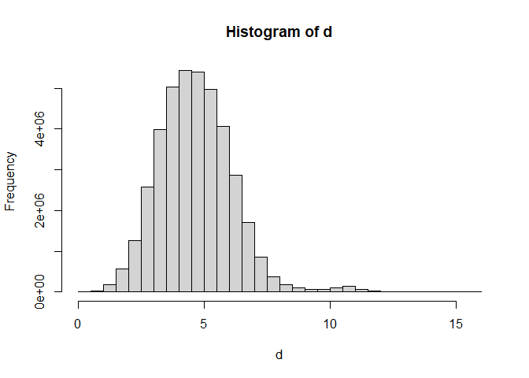
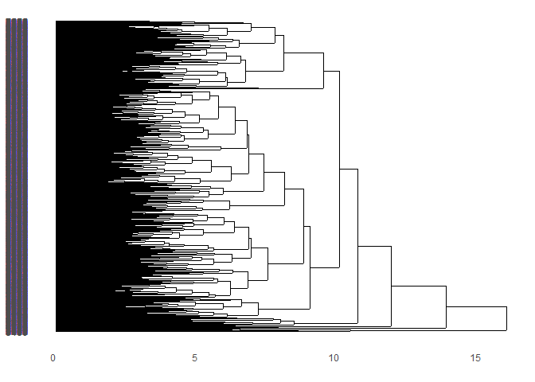
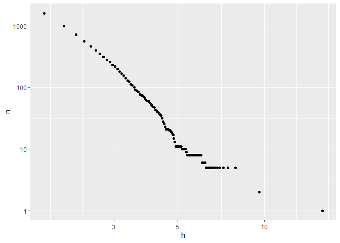

Proyecto 2
================

## Librerias

``` r
library(psych)
library(dplyr)
```

    ## 
    ## Attaching package: 'dplyr'

    ## The following objects are masked from 'package:stats':
    ## 
    ##     filter, lag

    ## The following objects are masked from 'package:base':
    ## 
    ##     intersect, setdiff, setequal, union

``` r
library(stringr)
library(datasets.load)
library(tidyverse)
```

    ## -- Attaching packages --------------------------------------- tidyverse 1.3.1 --

    ## v ggplot2 3.3.3     v readr   1.4.0
    ## v tibble  3.1.0     v purrr   0.3.4
    ## v tidyr   1.1.3     v forcats 0.5.1

    ## -- Conflicts ------------------------------------------ tidyverse_conflicts() --
    ## x ggplot2::%+%()   masks psych::%+%()
    ## x ggplot2::alpha() masks psych::alpha()
    ## x dplyr::filter()  masks stats::filter()
    ## x dplyr::lag()     masks stats::lag()

``` r
library(tm)
```

    ## Loading required package: NLP

    ## 
    ## Attaching package: 'NLP'

    ## The following object is masked from 'package:ggplot2':
    ## 
    ##     annotate

``` r
library(tidytext)
library(quanteda)
```

    ## Package version: 3.0.0
    ## Unicode version: 10.0
    ## ICU version: 61.1

    ## Parallel computing: 8 of 8 threads used.

    ## See https://quanteda.io for tutorials and examples.

    ## 
    ## Attaching package: 'quanteda'

    ## The following object is masked from 'package:tm':
    ## 
    ##     stopwords

    ## The following objects are masked from 'package:NLP':
    ## 
    ##     meta, meta<-

``` r
library(quanteda.textstats)
library(ggplot2)
library(wordcloud)
```

    ## Loading required package: RColorBrewer

``` r
library(lubridate)
```

    ## 
    ## Attaching package: 'lubridate'

    ## The following objects are masked from 'package:base':
    ## 
    ##     date, intersect, setdiff, union

``` r
library(readxl)
library(chron)
```

    ## 
    ## Attaching package: 'chron'

    ## The following objects are masked from 'package:lubridate':
    ## 
    ##     days, hours, minutes, seconds, years

``` r
library(factoextra)
```

    ## Welcome! Want to learn more? See two factoextra-related books at https://goo.gl/ve3WBa

``` r
library(flexclust)
```

    ## Loading required package: grid

    ## Loading required package: lattice

    ## Loading required package: modeltools

    ## Loading required package: stats4

``` r
library(cluster)
library(ggdendro)
library(factoextra)
library(knitr)
```

## Limpieza de datos

Para este dataset el proceso de limpieza de datos será un poco más
extensa por lo que debemos ir por partes

-   Primero verificar la existencia de valores NA o faltante

-   Realizaremos un estudio para ver la porción representativas de
    canciones con las que trabajaremos con respecto al dataframe
    original. -Analizaremos promedios, suma total, min, etc. y a partir
    de eso ocuparemos un porcentaje del dataframe que sea representativo
    y con valores estadísticos parecidos

-   Probaremos con el 2%, 2,5% y 5% de los datos y veremos si el los
    indicadores de MIN, MEDIAN, MEAN, 3RD QU, MAX son valores cercanos
    al dataframe con el 100% de los datos. Teniendo en cuenta que las
    variables analizar para el cluster son la lista de variables
    numéricas como DANCEABILITY, ENERGY, INSTRUMENTALNESS VALANCE ,
    TEMPO Y ACOUSTICNESS (Lamentablemente mi computador no puede
    trabajar con más del 2% de los datos, aun así el 2 de los datos
    sigue siendo representativo, los valores de las a variables a
    estudiar para la formación del cluster son cercano al de lo
    dataframe original )

Primero hicimos el estudio con la data completa y a partir de esto es
que generamos un archivo csv (write.table()) para trabajar de manera más
rápida.

``` r
#beats1 <- beats
#summary(beats1)
```

## Cargamos los datos

``` r
setwd("C:/Users/Dieca/OneDrive/Escritorio/FINAL P2 DIEGO")
beats1 <- read.csv("beats1.csv", sep = ",")
```

Como bien lo mencionamos anteriormente ocupamos el 2% de la dataframe lo
escrito en “\#” es como obtuvimos nuestro archivo csv.

``` r
beats1 <- beats1 %>% slice_sample(n= 8953)
summary(beats1)
```

    ##        X        artist_name         artist_id           album_id        
    ##  Min.   :   1   Length:8953        Length:8953        Length:8953       
    ##  1st Qu.:2239   Class :character   Class :character   Class :character  
    ##  Median :4477   Mode  :character   Mode  :character   Mode  :character  
    ##  Mean   :4477                                                           
    ##  3rd Qu.:6715                                                           
    ##  Max.   :8953                                                           
    ##                                                                         
    ##   album_type        album_release_date album_release_year
    ##  Length:8953        Length:8953        Min.   :1919      
    ##  Class :character   Class :character   1st Qu.:2010      
    ##  Mode  :character   Mode  :character   Median :2018      
    ##                                        Mean   :2013      
    ##                                        3rd Qu.:2020      
    ##                                        Max.   :2021      
    ##                                        NA's   :9         
    ##  album_release_date_precision  danceability       energy            key        
    ##  Length:8953                  Min.   :0.000   Min.   :0.0000   Min.   : 0.000  
    ##  Class :character             1st Qu.:0.254   1st Qu.:0.0772   1st Qu.: 2.000  
    ##  Mode  :character             Median :0.371   Median :0.2110   Median : 5.000  
    ##                               Mean   :0.392   Mean   :0.3424   Mean   : 5.066  
    ##                               3rd Qu.:0.512   3rd Qu.:0.5900   3rd Qu.: 8.000  
    ##                               Max.   :0.964   Max.   :1.0000   Max.   :11.000  
    ##                                                                                
    ##     loudness            mode         speechiness       acousticness   
    ##  Min.   :-60.000   Min.   :0.0000   Min.   :0.00000   Min.   :0.0000  
    ##  1st Qu.:-24.443   1st Qu.:0.0000   1st Qu.:0.03780   1st Qu.:0.3910  
    ##  Median :-19.240   Median :1.0000   Median :0.04430   Median :0.9230  
    ##  Mean   :-18.547   Mean   :0.6793   Mean   :0.06842   Mean   :0.7004  
    ##  3rd Qu.:-11.555   3rd Qu.:1.0000   3rd Qu.:0.05830   3rd Qu.:0.9860  
    ##  Max.   : -0.524   Max.   :1.0000   Max.   :0.96600   Max.   :0.9960  
    ##                                                                       
    ##  instrumentalness     liveness         valence           tempo       
    ##  Min.   :0.00000   Min.   :0.0000   Min.   :0.0000   Min.   :  0.00  
    ##  1st Qu.:0.00247   1st Qu.:0.0968   1st Qu.:0.0933   1st Qu.: 82.51  
    ##  Median :0.73400   Median :0.1220   Median :0.2770   Median :106.01  
    ##  Mean   :0.51174   Mean   :0.2223   Mean   :0.3408   Mean   :108.95  
    ##  3rd Qu.:0.90100   3rd Qu.:0.2560   3rd Qu.:0.5390   3rd Qu.:131.14  
    ##  Max.   :0.99900   Max.   :0.9960   Max.   :0.9890   Max.   :216.57  
    ##                                                                      
    ##    track_id         analysis_url       time_signature   disc_number    
    ##  Length:8953        Length:8953        Min.   :0.000   Min.   : 1.000  
    ##  Class :character   Class :character   1st Qu.:4.000   1st Qu.: 1.000  
    ##  Mode  :character   Mode  :character   Median :4.000   Median : 1.000  
    ##                                        Mean   :3.731   Mean   : 1.208  
    ##                                        3rd Qu.:4.000   3rd Qu.: 1.000  
    ##                                        Max.   :5.000   Max.   :25.000  
    ##                                                                        
    ##   duration_ms       explicit        track_href         is_local      
    ##  Min.   :   2987   Mode :logical   Length:8953        Mode :logical  
    ##  1st Qu.: 126688   FALSE:8861      Class :character   FALSE:8953     
    ##  Median : 197488   TRUE :92        Mode  :character                  
    ##  Mean   : 233617                                                     
    ##  3rd Qu.: 275000                                                     
    ##  Max.   :2058800                                                     
    ##                                                                      
    ##   track_name        track_preview_url   track_number        type          
    ##  Length:8953        Length:8953        Min.   :  1.00   Length:8953       
    ##  Class :character   Class :character   1st Qu.:  5.00   Class :character  
    ##  Mode  :character   Mode  :character   Median : 11.00   Mode  :character  
    ##                                        Mean   : 44.39                     
    ##                                        3rd Qu.: 29.00                     
    ##                                        Max.   :535.00                     
    ##                                                                           
    ##   track_uri         external_urls.spotify  album_name          key_name        
    ##  Length:8953        Length:8953           Length:8953        Length:8953       
    ##  Class :character   Class :character      Class :character   Class :character  
    ##  Mode  :character   Mode  :character      Mode  :character   Mode  :character  
    ##                                                                                
    ##                                                                                
    ##                                                                                
    ##                                                                                
    ##   mode_name           key_mode        
    ##  Length:8953        Length:8953       
    ##  Class :character   Class :character  
    ##  Mode  :character   Mode  :character  
    ##                                       
    ##                                       
    ##                                       
    ## 

``` r
#write.table(beats1, file = "beats1.csv", sep = ",", col.names = NA,
 #        qmethod = "double")
```

-   Segundo filtrar y remover datos duplicados

``` r
beats1 <- beats1[!duplicated(beats1$track_id),]
```

-   tercero, Seguimos con la limpieza Separamos las variables numéricas
    y char dos dataframes distintos

``` r
beats1_char <- c("artist_name", "artist_id", "album_id", "album_type", "album_release_date", "album_release_date_precision", "track_id", "analysis_url", "track_href", "track_name", "track_preview_url", "type", "track_uri", "external_urls.spotify", "album_name", "key_name", "mode_name", "key_mode")
beats1_num <- c("danceability", "energy", "key", "loudness", "mode", "speechiness", "acousticness", "instrumentalness", "liveness", "valence", "tempo", "duration_ms")
beats1 <- beats1 %>% 
  filter(!(is.na(key)|is.na(danceability)))
summary(beats1)
```

    ##        X        artist_name         artist_id           album_id        
    ##  Min.   :   1   Length:8953        Length:8953        Length:8953       
    ##  1st Qu.:2239   Class :character   Class :character   Class :character  
    ##  Median :4477   Mode  :character   Mode  :character   Mode  :character  
    ##  Mean   :4477                                                           
    ##  3rd Qu.:6715                                                           
    ##  Max.   :8953                                                           
    ##                                                                         
    ##   album_type        album_release_date album_release_year
    ##  Length:8953        Length:8953        Min.   :1919      
    ##  Class :character   Class :character   1st Qu.:2010      
    ##  Mode  :character   Mode  :character   Median :2018      
    ##                                        Mean   :2013      
    ##                                        3rd Qu.:2020      
    ##                                        Max.   :2021      
    ##                                        NA's   :9         
    ##  album_release_date_precision  danceability       energy            key        
    ##  Length:8953                  Min.   :0.000   Min.   :0.0000   Min.   : 0.000  
    ##  Class :character             1st Qu.:0.254   1st Qu.:0.0772   1st Qu.: 2.000  
    ##  Mode  :character             Median :0.371   Median :0.2110   Median : 5.000  
    ##                               Mean   :0.392   Mean   :0.3424   Mean   : 5.066  
    ##                               3rd Qu.:0.512   3rd Qu.:0.5900   3rd Qu.: 8.000  
    ##                               Max.   :0.964   Max.   :1.0000   Max.   :11.000  
    ##                                                                                
    ##     loudness            mode         speechiness       acousticness   
    ##  Min.   :-60.000   Min.   :0.0000   Min.   :0.00000   Min.   :0.0000  
    ##  1st Qu.:-24.443   1st Qu.:0.0000   1st Qu.:0.03780   1st Qu.:0.3910  
    ##  Median :-19.240   Median :1.0000   Median :0.04430   Median :0.9230  
    ##  Mean   :-18.547   Mean   :0.6793   Mean   :0.06842   Mean   :0.7004  
    ##  3rd Qu.:-11.555   3rd Qu.:1.0000   3rd Qu.:0.05830   3rd Qu.:0.9860  
    ##  Max.   : -0.524   Max.   :1.0000   Max.   :0.96600   Max.   :0.9960  
    ##                                                                       
    ##  instrumentalness     liveness         valence           tempo       
    ##  Min.   :0.00000   Min.   :0.0000   Min.   :0.0000   Min.   :  0.00  
    ##  1st Qu.:0.00247   1st Qu.:0.0968   1st Qu.:0.0933   1st Qu.: 82.51  
    ##  Median :0.73400   Median :0.1220   Median :0.2770   Median :106.01  
    ##  Mean   :0.51174   Mean   :0.2223   Mean   :0.3408   Mean   :108.95  
    ##  3rd Qu.:0.90100   3rd Qu.:0.2560   3rd Qu.:0.5390   3rd Qu.:131.14  
    ##  Max.   :0.99900   Max.   :0.9960   Max.   :0.9890   Max.   :216.57  
    ##                                                                      
    ##    track_id         analysis_url       time_signature   disc_number    
    ##  Length:8953        Length:8953        Min.   :0.000   Min.   : 1.000  
    ##  Class :character   Class :character   1st Qu.:4.000   1st Qu.: 1.000  
    ##  Mode  :character   Mode  :character   Median :4.000   Median : 1.000  
    ##                                        Mean   :3.731   Mean   : 1.208  
    ##                                        3rd Qu.:4.000   3rd Qu.: 1.000  
    ##                                        Max.   :5.000   Max.   :25.000  
    ##                                                                        
    ##   duration_ms       explicit        track_href         is_local      
    ##  Min.   :   2987   Mode :logical   Length:8953        Mode :logical  
    ##  1st Qu.: 126688   FALSE:8861      Class :character   FALSE:8953     
    ##  Median : 197488   TRUE :92        Mode  :character                  
    ##  Mean   : 233617                                                     
    ##  3rd Qu.: 275000                                                     
    ##  Max.   :2058800                                                     
    ##                                                                      
    ##   track_name        track_preview_url   track_number        type          
    ##  Length:8953        Length:8953        Min.   :  1.00   Length:8953       
    ##  Class :character   Class :character   1st Qu.:  5.00   Class :character  
    ##  Mode  :character   Mode  :character   Median : 11.00   Mode  :character  
    ##                                        Mean   : 44.39                     
    ##                                        3rd Qu.: 29.00                     
    ##                                        Max.   :535.00                     
    ##                                                                           
    ##   track_uri         external_urls.spotify  album_name          key_name        
    ##  Length:8953        Length:8953           Length:8953        Length:8953       
    ##  Class :character   Class :character      Class :character   Class :character  
    ##  Mode  :character   Mode  :character      Mode  :character   Mode  :character  
    ##                                                                                
    ##                                                                                
    ##                                                                                
    ##                                                                                
    ##   mode_name           key_mode        
    ##  Length:8953        Length:8953       
    ##  Class :character   Class :character  
    ##  Mode  :character   Mode  :character  
    ##                                       
    ##                                       
    ##                                       
    ## 

``` r
str(beats1)
```

    ## 'data.frame':    8953 obs. of  37 variables:
    ##  $ X                           : int  6816 2596 4672 1567 6430 7134 7745 5738 8328 471 ...
    ##  $ artist_name                 : chr  "Super Simple Songs" "Ludwig van Beethoven" "Gamma Ray" "Mother Nature Sound FX" ...
    ##  $ artist_id                   : chr  "7CdGfkCRgPhElnqy3HPJ4a" "2wOqMjp9TyABvtHdOSOTUS" "6LZE884lDIsCSLHuTplfGp" "4lrOh2SR7H3guHky2lAYOk" ...
    ##  $ album_id                    : chr  "2IDfqmrAmsyDA5DnGnQ0Ci" "3QKAfGXB5MSQmcWZxSj2JW" "4oSH59bA7AmNbfLgiaa7vv" "0wX0dVOgckzpEB8eGr320O" ...
    ##  $ album_type                  : chr  "album" "album" "album" "album" ...
    ##  $ album_release_date          : chr  "2017-03-24" "2020-11-25" "2010-02-17" "2020-03-23" ...
    ##  $ album_release_year          : int  2017 2020 2010 2020 2020 2015 2020 2015 2009 2014 ...
    ##  $ album_release_date_precision: chr  "day" "day" "day" "day" ...
    ##  $ danceability                : num  0.803 0.342 0.439 0.084 0.422 0.403 0.277 0.452 0.626 0.342 ...
    ##  $ energy                      : num  0.519 0.00256 0.976 0.971 0.0897 0.698 0.349 0.704 0.878 0.0289 ...
    ##  $ key                         : int  0 8 7 11 7 1 10 2 9 8 ...
    ##  $ loudness                    : num  -7.54 -38.64 -5.42 -27.32 -18.69 ...
    ##  $ mode                        : int  1 1 1 1 1 1 0 1 1 1 ...
    ##  $ speechiness                 : num  0.0632 0.0535 0.0732 0.0419 0.0589 0.0441 0.314 0.036 0.0314 0.0393 ...
    ##  $ acousticness                : num  0.0512 0.995 0.000301 0.203 0.971 0.234 0.281 0.0904 0.182 0.969 ...
    ##  $ instrumentalness            : num  0.018 0.935 0 0.751 0.793 0.011 0.771 0 0.00525 0.405 ...
    ##  $ liveness                    : num  0.241 0.128 0.26 0.606 0.115 0.931 0.336 0.0997 0.113 0.128 ...
    ##  $ valence                     : num  0.843 0.0899 0.247 0.00001 0.582 0.413 0.0391 0.39 0.741 0.265 ...
    ##  $ tempo                       : num  148.5 70.4 128 167.9 107.2 ...
    ##  $ track_id                    : chr  "3gWZvdrrN5Q0fGcJoENv6I" "1QfKH4FNhtvC8M7DHHH0WG" "429sfl9LqO8HKi9UXyD8Mn" "1PCWdlybRHVC37d1aCVGQm" ...
    ##  $ analysis_url                : chr  "https://api.spotify.com/v1/audio-analysis/3gWZvdrrN5Q0fGcJoENv6I" "https://api.spotify.com/v1/audio-analysis/1QfKH4FNhtvC8M7DHHH0WG" "https://api.spotify.com/v1/audio-analysis/429sfl9LqO8HKi9UXyD8Mn" "https://api.spotify.com/v1/audio-analysis/1PCWdlybRHVC37d1aCVGQm" ...
    ##  $ time_signature              : int  3 4 4 3 1 1 4 4 4 3 ...
    ##  $ disc_number                 : int  1 1 1 1 1 1 1 1 1 1 ...
    ##  $ duration_ms                 : int  118726 404960 307692 60395 194773 316819 130089 208125 223186 234520 ...
    ##  $ explicit                    : logi  FALSE FALSE FALSE FALSE FALSE FALSE ...
    ##  $ track_href                  : chr  "https://api.spotify.com/v1/tracks/3gWZvdrrN5Q0fGcJoENv6I" "https://api.spotify.com/v1/tracks/1QfKH4FNhtvC8M7DHHH0WG" "https://api.spotify.com/v1/tracks/429sfl9LqO8HKi9UXyD8Mn" "https://api.spotify.com/v1/tracks/1PCWdlybRHVC37d1aCVGQm" ...
    ##  $ is_local                    : logi  FALSE FALSE FALSE FALSE FALSE FALSE ...
    ##  $ track_name                  : chr  "This Is The Way (Sing-Along) - Instrumental" "<U+30D4><U+30A2><U+30CE>·<U+30BD><U+30CA><U+30BF><U+7B2C>8<U+756A><U+30CF><U+77ED><U+8ABF> <U+4F5C><U+54C1>13<U"| __truncated__ "One Life" "Rain Serenity" ...
    ##  $ track_preview_url           : chr  "https://p.scdn.co/mp3-preview/a1d9638ea63c90fd83d89995b9a6b18b25fb1975?cid=ac26d97eca664234ab133e5208ea5737" "https://p.scdn.co/mp3-preview/610999746c61bf092f263aa3830ede0be506d154?cid=ac26d97eca664234ab133e5208ea5737" "https://p.scdn.co/mp3-preview/d32a61a33d22d107976ca8e453a358ee4eabf910?cid=ac26d97eca664234ab133e5208ea5737" "https://p.scdn.co/mp3-preview/7d8836b3253e6f89e1fec4e6fa29521fcf14a071?cid=ac26d97eca664234ab133e5208ea5737" ...
    ##  $ track_number                : int  25 2 11 15 420 16 2 24 7 4 ...
    ##  $ type                        : chr  "track" "track" "track" "track" ...
    ##  $ track_uri                   : chr  "spotify:track:3gWZvdrrN5Q0fGcJoENv6I" "spotify:track:1QfKH4FNhtvC8M7DHHH0WG" "spotify:track:429sfl9LqO8HKi9UXyD8Mn" "spotify:track:1PCWdlybRHVC37d1aCVGQm" ...
    ##  $ external_urls.spotify       : chr  "https://open.spotify.com/track/3gWZvdrrN5Q0fGcJoENv6I" "https://open.spotify.com/track/1QfKH4FNhtvC8M7DHHH0WG" "https://open.spotify.com/track/429sfl9LqO8HKi9UXyD8Mn" "https://open.spotify.com/track/1PCWdlybRHVC37d1aCVGQm" ...
    ##  $ album_name                  : chr  "Baby Shark & More Kids Songs" "<U+30D9><U+30FC><U+30C8><U+30FC><U+30F4><U+30A7><U+30F3>:<U+30D4><U+30A2><U+30CE>·<U+30BD><U+30CA><U+30BF><U+30"| __truncated__ "To The Metal" "! +\"( Exposing )\"+ !" ...
    ##  $ key_name                    : chr  "C" "G#" "G" "B" ...
    ##  $ mode_name                   : chr  "major" "major" "major" "major" ...
    ##  $ key_mode                    : chr  "C major" "G# major" "G major" "B major" ...

## Separo Datos

``` r
beats1num <- beats1 %>% 
  select(beats1_num)
```

    ## Note: Using an external vector in selections is ambiguous.
    ## i Use `all_of(beats1_num)` instead of `beats1_num` to silence this message.
    ## i See <https://tidyselect.r-lib.org/reference/faq-external-vector.html>.
    ## This message is displayed once per session.

``` r
beats1char <- beats1 %>% 
  select(beats1_char)
```

    ## Note: Using an external vector in selections is ambiguous.
    ## i Use `all_of(beats1_char)` instead of `beats1_char` to silence this message.
    ## i See <https://tidyselect.r-lib.org/reference/faq-external-vector.html>.
    ## This message is displayed once per session.

## Escalar Datos

``` r
beats1_sca <- sapply(beats1num, scale)
beats1_sca %>% summary()
```

    ##   danceability         energy             key              loudness       
    ##  Min.   :-2.1554   Min.   :-1.0720   Min.   :-1.44671   Min.   :-4.80747  
    ##  1st Qu.:-0.7590   1st Qu.:-0.8304   1st Qu.:-0.87551   1st Qu.:-0.68381  
    ##  Median :-0.1157   Median :-0.4115   Median :-0.01872   Median :-0.08041  
    ##  Mean   : 0.0000   Mean   : 0.0000   Mean   : 0.00000   Mean   : 0.00000  
    ##  3rd Qu.: 0.6595   3rd Qu.: 0.7750   3rd Qu.: 0.83806   3rd Qu.: 0.81085  
    ##  Max.   : 3.1446   Max.   : 2.0585   Max.   : 1.69485   Max.   : 2.09015  
    ##       mode         speechiness       acousticness     instrumentalness 
    ##  Min.   :-1.455   Min.   :-0.7489   Min.   :-1.9007   Min.   :-1.2384  
    ##  1st Qu.:-1.455   1st Qu.:-0.3351   1st Qu.:-0.8397   1st Qu.:-1.2324  
    ##  Median : 0.687   Median :-0.2640   Median : 0.6039   Median : 0.5378  
    ##  Mean   : 0.000   Mean   : 0.0000   Mean   : 0.0000   Mean   : 0.0000  
    ##  3rd Qu.: 0.687   3rd Qu.:-0.1108   3rd Qu.: 0.7748   3rd Qu.: 0.9420  
    ##  Max.   : 0.687   Max.   : 9.8242   Max.   : 0.8020   Max.   : 1.1791  
    ##     liveness          valence            tempo           duration_ms     
    ##  Min.   :-1.0149   Min.   :-1.2420   Min.   :-3.45667   Min.   :-1.2960  
    ##  1st Qu.:-0.5728   1st Qu.:-0.9020   1st Qu.:-0.83883   1st Qu.:-0.6009  
    ##  Median :-0.4578   Median :-0.2325   Median :-0.09332   Median :-0.2030  
    ##  Mean   : 0.0000   Mean   : 0.0000   Mean   : 0.00000   Mean   : 0.0000  
    ##  3rd Qu.: 0.1541   3rd Qu.: 0.7223   3rd Qu.: 0.70401   3rd Qu.: 0.2325  
    ##  Max.   : 3.5332   Max.   : 2.3622   Max.   : 3.41442   Max.   :10.2565

\#\# Clusters Jerarquicos

Calcularemos las distancias euclidianas a partir de la matriz de
distancias entre las entidades.

``` r
#Distancia euclideana
d = dist(beats1_sca, method = "euclidean")

hist(d)
```

<!-- --> Utilizando la
función de R base hclust, aplicamos hierarchical clustering, a partir de
la matriz de distancias d, y utilizamos el criterio complete linkage

``` r
model_complete = hclust(d, method="complete") 

summary(model_complete)
```

    ##             Length Class  Mode     
    ## merge       17904  -none- numeric  
    ## height       8952  -none- numeric  
    ## order        8953  -none- numeric  
    ## labels          0  -none- NULL     
    ## method          1  -none- character
    ## call            3  -none- call     
    ## dist.method     1  -none- character

Generamos un dendrograma para visualizar la jerarquía. utilizamos la
función vista en clases de ggdendrogram

``` r
ggdendrogram(model_complete, rotate = TRUE, theme_dendro = TRUE) 
```

<!-- -->

``` r
model_ward = hclust(d, method="ward.D") 
#model_ward2 = hclust(d, method="ward.D2") 
#model_single = hclust(d, method="single")
model_average = hclust(d, method="average") 
#model_mcquitty = hclust(d, method="mcquitty") 
#model_median = hclust(d, method="median") 
#model_centroid = hclust(d, method="centroid") 

summary(model_ward)
```

    ##             Length Class  Mode     
    ## merge       17904  -none- numeric  
    ## height       8952  -none- numeric  
    ## order        8953  -none- numeric  
    ## labels          0  -none- NULL     
    ## method          1  -none- character
    ## call            3  -none- call     
    ## dist.method     1  -none- character

## Arboles

Realizaremos el corte en h=5 y veremos cuantos clusters vamos a obtener.

``` r
groups <- cutree(model_complete, h = 5)
coefsil <- silhouette(groups, d)
groups %>% unique() %>% length()
```

    ## [1] 119

``` r
summary(coefsil)
```

    ## Silhouette of 8953 units in 119 clusters from silhouette.default(x = groups, dist = d) :
    ##  Cluster sizes and average silhouette widths:
    ##           265           147           209            45           364 
    ##  0.0110442477 -0.0526605299  0.1153000603  0.0858103272  0.0087556899 
    ##           109            33           228            55           100 
    ##  0.1109984335  0.1922653299  0.0788920895  0.0846739117  0.0983263819 
    ##            96           467           325            93            26 
    ##  0.1220109271  0.0517463397  0.0606127352  0.0607148321  0.1045648351 
    ##           262           164            84            76           267 
    ##  0.0329338995  0.1615334349  0.2099816437  0.0140555280  0.1362049384 
    ##           449           175           243            75            49 
    ## -0.0927214310  0.1247109669  0.1340131896 -0.0617719147  0.0508734973 
    ##           112           130           153            48           233 
    ##  0.0670894209  0.0077807125  0.0734782914  0.1497483471  0.0977699267 
    ##           148           125            41            59           182 
    ##  0.1876915191 -0.0252670450  0.0774322560  0.0962139280 -0.0679341481 
    ##            86             8            30            28           199 
    ## -0.0224462647  0.1207351083  0.0442158172  0.1979679856  0.1503042083 
    ##            25           135            19           224           184 
    ##  0.1940213354  0.1579233440  0.2583442527  0.1036323753 -0.0472518136 
    ##           148            33            20            19           126 
    ##  0.0521107921  0.3021825206  0.2129070646  0.0882727503 -0.0136773474 
    ##            37            28            38           105             8 
    ##  0.1121952590  0.0535442152  0.0676543348 -0.0917070119  0.1723672473 
    ##           104            47            65            55           108 
    ##  0.1496131410  0.0852195663  0.1258074534  0.0005871368  0.1239755713 
    ##            10            91            57           106            23 
    ##  0.2821130955  0.0156467524  0.0902637120  0.0045726714 -0.0356746688 
    ##            56            95            18            48            37 
    ##  0.0918981712  0.0870825778  0.1940673896  0.0110868642  0.2319162234 
    ##             4            45             4            25            11 
    ##  0.1713910037  0.0277343694  0.0571951977  0.0625769570  0.0499248557 
    ##            10            13            27            67            64 
    ##  0.0038690511  0.6635537554  0.0563269489 -0.0071844729  0.0990494496 
    ##             5            14            80            20            41 
    ##  0.2841134217  0.1472170997  0.0489406214 -0.0486384678  0.1335603484 
    ##            14             8             8            24            18 
    ##  0.4568276408  0.2662295917  0.1677570491  0.2025016718  0.1855982743 
    ##            35             9            10            86            14 
    ##  0.2383239139 -0.0366895874  0.1399171368  0.0499492138  0.0288518844 
    ##            21             9            49             8            12 
    ##  0.0790748934  0.1994375464  0.0682624023  0.0497809640  0.3807944662 
    ##             7             7            17            14            21 
    ##  0.4491152734  0.2351169892  0.2311162505  0.2017346976  0.0715084658 
    ##            10             8             5             8             7 
    ##  0.0638208872  0.2061033008  0.1829338429  0.0998315721  0.0916063924 
    ##             9             3             3             7             8 
    ##  0.0993802879  0.3388537956  0.0247960640  0.0266505377  0.0315508690 
    ##             3             2             1             1 
    ##  0.1766652455  0.2913084397  0.0000000000  0.0000000000 
    ## Individual silhouette widths:
    ##     Min.  1st Qu.   Median     Mean  3rd Qu.     Max. 
    ## -0.45287 -0.03872  0.07508  0.06587  0.17212  0.81941

``` r
##se generan 119 clusters
```

\#\#Puntos de corte Compararemos distintos puntos de corte de la
jerarquía

``` r
res <- tibble("h" = quantile(d, probs  = (1:100)/100), n = 0)

for (i in 1:100){
  groups <- cutree(model_average, h = res$h[i])  
  res$n[i] <- groups %>% unique() %>% length()
}  

ggplot(res, aes(h, n)) + 
  geom_point() + 
  scale_x_log10() + 
  scale_y_log10()
```

<!-- -->

## Corte

Determinamos un valor para h lo que nos entregara un valor distinto de k
para cada h que escogamos, tambien podemos definir el k desde un inicio
Se imprimen los tamaños de cada cluster Generamos una nueva columna para
almacenar a que cluster pertenece cada observacion (tanto en data\_pre y
datanum) Graficamos las observaciones agrupadas por su cluster

``` r
groups <- cutree(model_complete, h = 10)
table(groups)
```

    ## groups
    ##    1    2    3    4    5    6    7 
    ## 1959 6605  235   27   69   57    1

``` r
beats1$clust <- as.factor(groups)
beats1num$clust <- as.factor(groups)
fviz_cluster(list(data = beats1_sca, cluster = groups))
```

<!-- -->

## Caracteristicas de los clusters encontrados

``` r
beats1num$clust <- as.numeric(as.character(beats1num$clust))
# Generamos una tabla que almacenara los valores promedios para cada uno de los clusters encontrados lo que nos permitira caracterizar a cada uno de ellos
infoclusters <- aggregate(beats1num, by=list(cluster=beats1num$clust), mean)
# Borramos la columna clust ya que se repite esa informacion en la tabla generada
infoclusters$clust <- NULL
# Transformamos el tiempo de la cancion a minutos
infoclusters <- infoclusters %>% mutate(duration_min = infoclusters$duration_ms/60000)
# Borramos la columna de la duracion en milisegundoss
infoclusters$duration_ms <- NULL
infoclusters
```

    ##   cluster danceability    energy      key   loudness      mode speechiness
    ## 1       1  0.535787443 0.7336448 5.242981  -7.515503 0.6294028 0.063306993
    ## 2       2  0.345633520 0.2165256 5.026344 -21.976138 0.6965935 0.052188130
    ## 3       3  0.520412340 0.6464537 4.340426 -13.572153 0.6425532 0.360318298
    ## 4       4  0.002914815 0.2003622 5.407407 -23.369296 0.4814815 0.001659259
    ## 5       5  0.576000000 0.3882490 6.768116 -19.029464 0.6231884 0.801579710
    ## 6       6  0.259408772 0.2483175 4.368421 -17.925281 0.7017544 0.050296491
    ## 7       7  0.540000000 0.2850000 0.000000 -18.075000 1.0000000 0.936000000
    ##   acousticness instrumentalness  liveness     valence      tempo duration_min
    ## 1    0.1813637       0.13460191 0.2971849 0.511031240 125.857890     4.403455
    ## 2    0.8615787       0.63877324 0.1926085 0.291071272 104.405106     3.644485
    ## 3    0.4465417       0.23382541 0.3653468 0.380008085 110.328106     3.128712
    ## 4    0.8470000       0.23005121 0.3682926 0.009888889   1.290963     1.048318
    ## 5    0.7252464       0.05246031 0.4232232 0.440328986 111.909725     2.130129
    ## 6    0.8191330       0.59799410 0.1814298 0.125210526  97.239368    21.522108
    ## 7    0.5640000       0.00000000 0.1020000 0.464000000  63.657000    24.056283

\#\#Seperamos los cluster para visualizarlos de mejor manera

``` r
beats_clus1 <- filter(beats1, clust == "1")
beats_clus2 <- filter(beats1, clust == "2")
beats_clus3 <- filter(beats1, clust == "3")
beats_clus4 <- filter(beats1, clust == "4")
beats_clus5 <- filter(beats1, clust == "5")
beats_clus6 <- filter(beats1, clust == "6")
beats_clus7 <- filter(beats1, clust == "7")
#beats_clus8 <- filter(beats1, clust == "8")
```

\#Luego del Analisis Cluster realizado para ver el comportamiento de las
variables entre si, a partir de las caracteristicas de los cluster
econtrados procederemos a seleccionar las variables que nos permitiran
realizar la playlist .

## cluster 1, Musica clasica y relajante.

mode, Contenido melodico acousticness, contenido melodico
instrumentalness,no tienen contenido vocal

En esta parte del codigo nos ocupamos de diferenciar las partes de
cluster 3, con el fin de que la canciones de esta misma sean aun mas
similares, ademas pasamos de trabajar de segundos a minutos para
agilizar el trabajo. Usaremos solo aquellas canciones que tengan como
valor numerico arriba de 0.5 en acousticness e instrumentalness.

``` r
beats_clus1 <- beats_clus1 %>% mutate(duration_min = beats_clus1$duration_ms/60000)
beats_clus1 <- beats_clus1 %>% select(artist_name, track_name, album_name,  mode, acousticness,instrumentalness, duration_min, clust )

#kable(head(beats_clus2))
beats_clus1_mode <- filter(beats_clus1, mode == 1)
beats_clus1_mode_and_acu <- filter(beats_clus1_mode, acousticness > 0.5)
beats_clus1_m_a_i <- filter(beats_clus1_mode_and_acu, instrumentalness > 0.5)
```

## Empezamos con la creacion de la playlist.

Para realizar la playlist nos hemos quedado con el cluster 1 de música
relajante y clásica. calculamos distancias de cada una de las
observaciones y lo guardamos en una matriz. Escogemos una canción del
cluster y posteriormente seleccionamos su columna de distancias al resto
de las observaciones Por último, ordenamos de menor a mayor

``` r
spo_playlist <- filter(beats_clus1_m_a_i, clust == 1)

x2 <- spo_playlist[,!colnames(spo_playlist) %in% c("artist_name", "track_name","album_name", "clust")]
d2 <- dist(x2) %>% as.matrix()

x2$dist_eucl <- d2[,2]
spo_playlist$dist_eucl <- d2[,2]

x2 <- x2[order(x2$dist_eucl, decreasing = FALSE), ]
spo_playlist <- spo_playlist[order(spo_playlist$dist_eucl, decreasing = FALSE),]
```

``` r
data_playlist <- spo_playlist[, colnames(spo_playlist) %in% c("artist_name", "track_name","duration_min", "dist_eucl")]
#data_playlist <- data_playlist[-,]
#spo_playlist <- spo_playlist[-,]

data_playlist$artist_name <- as.character(data_playlist$artist_name)
data_playlist$track_name <- as.character(data_playlist$track_name)
```

## Creacion de playlist con ciclo for y while (PLAYLIST MUSICA RELAJANTE/CLASICA)

Creamos variables de inicio para hacer el recorrido de la duración de la
playlist desde 0 a 180 minutos (3 horas de música), es por esto que
utilizamos la iteración while con el fin de contarnos la duración de la
playlist hasta que el tiempo sea mayor que 180 para que deje de agregar
canciones a la lista. El ciclo for para recorrer la lista en si e ir
guardando cada canción a esta.

``` r
data_playlist
```

    ##                 artist_name
    ## 2               Miles Davis
    ## 7            Antonín Dvorák
    ## 4            Antonín Dvorák
    ## 1  Pyotr Ilyich Tchaikovsky
    ## 5      Ludwig van Beethoven
    ## 12          Frédéric Chopin
    ## 14    Johann Sebastian Bach
    ## 3      Ludwig van Beethoven
    ## 16     Ludwig van Beethoven
    ## 6               Miles Davis
    ## 11    Johann Sebastian Bach
    ## 13 Pyotr Ilyich Tchaikovsky
    ## 10               Quilapayún
    ## 15                Daft Punk
    ## 8      Soft Jazz Relaxation
    ## 9                Neal Acree
    ##                                                                                                                       track_name
    ## 2                                                   My Funny Valentine - Live at Philharmonic Hall, New York, NY - February 1964
    ## 7                                                                    Nature, Life and Love, Op. 91, B. 168: I. In Nature´s Realm
    ## 4                                                                                                      In Nature's Realm, Op. 91
    ## 1                                                                                                      Capriccio Italien, Op. 45
    ## 5      Piano Sonata No. 30 in E Major, Op. 109: III. Gesangvoll, mit innigster Empfindung. Andante molto cantabile ed espressivo
    ## 12                                                                           Polonaise No.7 in A flat, Op.61 Polonaise-Fantaisie
    ## 14                                                                               Brandenburg Concerto No. 2 in F Major, BWV 1047
    ## 3                                                           Symphony No. 3 in E-Flat Major, Op. 55 "Eroica": I. Allegro con brio
    ## 16 Symphony No. 3 in E-Flat Major, Op. 55 "Eroica": Symphony No. 3 in E-Flat Major, Op. 55, "Eroica": IV. Finale (Allegro molto)
    ## 6                                                                                                            Two Faced - New Mix
    ## 11                                                                               Brandenburg Concerto No. 1 in F Major, BWV 1046
    ## 13                                     Romeo and Juliet Fantasy Overture (3rd version, 1880) (arr. N. Purgold for piano 4-hands)
    ## 10                                                                                                   Danza Di Calaluna - En Vivo
    ## 15                                                                                                                     Make Love
    ## 8                                                                                                                   Do It Anyway
    ## 9                                                                                                               Lair Of The Wolf
    ##    duration_min  dist_eucl
    ## 2     15.015550  0.0000000
    ## 7     14.886667  0.1414599
    ## 4     14.792000  0.2384106
    ## 1     15.544883  0.5934760
    ## 5     14.378883  0.7386816
    ## 12    13.705767  1.3563777
    ## 14    13.662667  1.3610578
    ## 3     16.640000  1.6388248
    ## 16    12.542067  2.4890986
    ## 6     18.013333  3.0049497
    ## 11    20.079333  5.0654174
    ## 13    20.143767  5.1407488
    ## 10     5.210667  9.8072008
    ## 15     4.828000 10.1910926
    ## 8      3.463783 11.5604258
    ## 9      2.754667 12.2677620

``` r
playlist_oficial <- NULL
durationplaylist_in <- 0
durationplaylist_fin <- 180


while ( durationplaylist_in < durationplaylist_fin) {
  
  for(i in nrow(data_playlist)) {
    durationplaylist_in <- durationplaylist_in
    

    song <- data_playlist[i,"track_name"]
    durationsong <- data_playlist[i,"duration_min"]
    print(song)
    print(durationsong)
    
    
    
    if(durationplaylist_in < durationplaylist_fin) {
      
      
      playlist_oficial <- rbind(playlist_oficial, data_playlist[i,])
      durationplaylist_in <- durationplaylist_in + durationsong
      data_playlist <- data_playlist[-i,]
      
    }  
      
    
    print(durationplaylist_in)
    #playlist <- rbind(playlist, )
  }

}
```

    ## [1] "Lair Of The Wolf"
    ## [1] 2.754667
    ## [1] 2.754667
    ## [1] "Do It Anyway"
    ## [1] 3.463783
    ## [1] 6.21845
    ## [1] "Make Love"
    ## [1] 4.828
    ## [1] 11.04645
    ## [1] "Danza Di Calaluna - En Vivo"
    ## [1] 5.210667
    ## [1] 16.25712
    ## [1] "Romeo and Juliet Fantasy Overture (3rd version, 1880) (arr. N. Purgold for piano 4-hands)"
    ## [1] 20.14377
    ## [1] 36.40088
    ## [1] "Brandenburg Concerto No. 1 in F Major, BWV 1046"
    ## [1] 20.07933
    ## [1] 56.48022
    ## [1] "Two Faced - New Mix"
    ## [1] 18.01333
    ## [1] 74.49355
    ## [1] "Symphony No. 3 in E-Flat Major, Op. 55 \"Eroica\": Symphony No. 3 in E-Flat Major, Op. 55, \"Eroica\": IV. Finale (Allegro molto)"
    ## [1] 12.54207
    ## [1] 87.03562
    ## [1] "Symphony No. 3 in E-Flat Major, Op. 55 \"Eroica\": I. Allegro con brio"
    ## [1] 16.64
    ## [1] 103.6756
    ## [1] "Brandenburg Concerto No. 2 in F Major, BWV 1047"
    ## [1] 13.66267
    ## [1] 117.3383
    ## [1] "Polonaise No.7 in A flat, Op.61 Polonaise-Fantaisie"
    ## [1] 13.70577
    ## [1] 131.0441
    ## [1] "Piano Sonata No. 30 in E Major, Op. 109: III. Gesangvoll, mit innigster Empfindung. Andante molto cantabile ed espressivo"
    ## [1] 14.37888
    ## [1] 145.4229
    ## [1] "Capriccio Italien, Op. 45"
    ## [1] 15.54488
    ## [1] 160.9678
    ## [1] "In Nature's Realm, Op. 91"
    ## [1] 14.792
    ## [1] 175.7598
    ## [1] "Nature, Life and Love, Op. 91, B. 168: I. In Nature´s Realm"
    ## [1] 14.88667
    ## [1] 190.6465

## cluster 2

canciones alegres valence danceability tempo

``` r
beats_clus2 <- beats_clus2 %>% mutate(duration_min = beats_clus2$duration_ms/60000)

beats_clus2 <- beats_clus2 %>% select(artist_name, track_name, valence, danceability, acousticness, tempo,duration_min, clust)
#kable(head(beats_clus2))
beats_clus2_valence <- filter(beats_clus2, valence > 0.5)
beats_clus2_valence_and_dance <- filter(beats_clus2_valence, danceability > 0.5)
beats_clus2_v_d_t <- filter(beats_clus2_valence_and_dance, tempo > 110)
```

## AHORA CON EL CLUSTER 2 (MUSICA ALEGRE) con la creacion de la playlist.

Para realizar la playlist nos hemos quedado con el cluster 2 de música
alegre y bailable. calculamos distancias de cada una de las
observaciones y lo guardamos en una matriz. Escogemos una canción del
cluster y posteriormente seleccionamos su columna de distancias al resto
de las observaciones Por último ordenamos de menor a mayor

``` r
spo_playlist_CLUS2 <- filter(beats_clus2_v_d_t, clust == 2)

x2_CLUS2 <- spo_playlist_CLUS2[,!colnames(spo_playlist_CLUS2) %in% c("artist_name", "track_name","album_name", "clust")]
d2_CLUS2 <- dist(x2_CLUS2) %>% as.matrix()

x2_CLUS2$dist_eucl <- d2_CLUS2[,2]
spo_playlist_CLUS2$dist_eucl <- d2_CLUS2[,2]

x2_CLUS2 <- x2_CLUS2[order(x2_CLUS2$dist_eucl, decreasing = FALSE), ]
spo_playlist_CLUS2 <- spo_playlist_CLUS2[order(spo_playlist_CLUS2$dist_eucl, decreasing = FALSE),]
```

``` r
data_playlist_CLUS2 <- spo_playlist_CLUS2[, colnames(spo_playlist_CLUS2) %in% c("artist_name", "track_name","duration_min", "dist_eucl")]
#data_playlist <- data_playlist[-19,]
#spo_playlist <- spo_playlist[-19,]

data_playlist_CLUS2$artist_name <- as.character(data_playlist_CLUS2$artist_name)
data_playlist_CLUS2$track_name <- as.character(data_playlist_CLUS2$track_name)
```

## Creacion de playlist con ciclo for y while (MUSICA ALEGRE Y BAILABLE)

Creamos variables de inicio para hacer el recorrido de la duración de la
playlist desde 0 a 180 minutos (3 horas de música), es por esto que
utilizamos la iteración while con el fin de contarnos la duración de la
playlist hasta que el tiempo sea mayor que 180 para que deje de agregar
canciones a la lista. El ciclo for para recorrer la lista en si e ir
guardando cada canción a esta.

``` r
data_playlist_CLUS2
```

    ##                  artist_name
    ## 2         Super Simple Songs
    ## 40   Wolfgang Amadeus Mozart
    ## 67   Wolfgang Amadeus Mozart
    ## 106             The National
    ## 61                     Sting
    ## 132    Johann Sebastian Bach
    ## 240            Ariana Grande
    ## 202          Frédéric Chopin
    ## 57            Nana Mouskouri
    ## 115      Easy Listening Jazz
    ## 113            John Coltrane
    ## 281      Easy Listening Jazz
    ## 178    Johann Sebastian Bach
    ## 212    Johann Sebastian Bach
    ## 274    Johann Sebastian Bach
    ## 266             Eric Clapton
    ## 20           Frédéric Chopin
    ## 164          Frédéric Chopin
    ## 251            Charly García
    ## 175            Charly García
    ## 194      Easy Listening Jazz
    ## 124      Easy Listening Jazz
    ## 133     Ludwig van Beethoven
    ## 250           Nana Mouskouri
    ## 247    Johann Sebastian Bach
    ## 237  Wolfgang Amadeus Mozart
    ## 136      Easy Listening Jazz
    ## 46            Nana Mouskouri
    ## 287  Wolfgang Amadeus Mozart
    ## 211  Wolfgang Amadeus Mozart
    ## 284  Wolfgang Amadeus Mozart
    ## 223    Johann Sebastian Bach
    ## 147     Soft Jazz Relaxation
    ## 258  Wolfgang Amadeus Mozart
    ## 126    Johann Sebastian Bach
    ## 142    Johann Sebastian Bach
    ## 9    Wolfgang Amadeus Mozart
    ## 290  Wolfgang Amadeus Mozart
    ## 256  Wolfgang Amadeus Mozart
    ## 14       Easy Listening Jazz
    ## 37             Sérgio Mendes
    ## 260     Ludwig van Beethoven
    ## 207  Wolfgang Amadeus Mozart
    ## 255  Wolfgang Amadeus Mozart
    ## 82               Iron & Wine
    ## 191    Johann Sebastian Bach
    ## 24   Wolfgang Amadeus Mozart
    ## 152  Wolfgang Amadeus Mozart
    ## 292    Johann Sebastian Bach
    ## 63     Johann Sebastian Bach
    ## 4            Frédéric Chopin
    ## 154            Violeta Parra
    ## 193     Ludwig van Beethoven
    ## 118     Ludwig van Beethoven
    ## 23   Wolfgang Amadeus Mozart
    ## 102      Easy Listening Jazz
    ## 28     Johann Sebastian Bach
    ## 185    Johann Sebastian Bach
    ## 21      Ludwig van Beethoven
    ## 197        Vicente Fernández
    ## 131     Ludwig van Beethoven
    ## 71     Johann Sebastian Bach
    ## 148    Johann Sebastian Bach
    ## 8                Miles Davis
    ## 275    Johann Sebastian Bach
    ## 116     Ludwig van Beethoven
    ## 48     Johann Sebastian Bach
    ## 85             Sérgio Mendes
    ## 22     Johann Sebastian Bach
    ## 246      Easy Listening Jazz
    ## 77   Wolfgang Amadeus Mozart
    ## 208  Wolfgang Amadeus Mozart
    ## 209  Wolfgang Amadeus Mozart
    ## 138     Ludwig van Beethoven
    ## 156    Johann Sebastian Bach
    ## 42   Wolfgang Amadeus Mozart
    ## 162            Violeta Parra
    ## 253     Ludwig van Beethoven
    ## 283     Ludwig van Beethoven
    ## 79   Wolfgang Amadeus Mozart
    ## 280  Wolfgang Amadeus Mozart
    ## 7        Easy Listening Jazz
    ## 54  Bob Marley & The Wailers
    ## 224           Tommy Guerrero
    ## 3               Eric Clapton
    ## 245      Easy Listening Jazz
    ## 270     Ludwig van Beethoven
    ## 121          Michael Jackson
    ## 228     Ludwig van Beethoven
    ## 273     Ludwig van Beethoven
    ## 188    Johann Sebastian Bach
    ## 262    Johann Sebastian Bach
    ## 272    Johann Sebastian Bach
    ## 235    Johann Sebastian Bach
    ## 16     Johann Sebastian Bach
    ## 15  Pyotr Ilyich Tchaikovsky
    ## 231    Johann Sebastian Bach
    ## 123            Stevie Wonder
    ## 43   Wolfgang Amadeus Mozart
    ## 62   Wolfgang Amadeus Mozart
    ## 83   Wolfgang Amadeus Mozart
    ## 179        Vicente Fernández
    ## 196     Ludwig van Beethoven
    ## 137      Easy Listening Jazz
    ## 288     Ludwig van Beethoven
    ## 249    Johann Sebastian Bach
    ## 97      Ludwig van Beethoven
    ## 51     Johann Sebastian Bach
    ## 149    Johann Sebastian Bach
    ## 182    Johann Sebastian Bach
    ## 114  Wolfgang Amadeus Mozart
    ## 243      Easy Listening Jazz
    ## 103            Violeta Parra
    ## 192               Quilapayún
    ## 264     Ludwig van Beethoven
    ## 100                    Feist
    ## 271             RÜFÜS DU SOL
    ## 160     Soft Jazz Relaxation
    ## 291       Super Simple Songs
    ## 222                Ana Belén
    ## 41            Ismael Serrano
    ## 34            Nana Mouskouri
    ## 239        Vicente Fernández
    ## 44   Wolfgang Amadeus Mozart
    ## 150  Wolfgang Amadeus Mozart
    ## 70    Mother Nature Sound FX
    ## 181   Mother Nature Sound FX
    ## 269   Mother Nature Sound FX
    ## 1     Mother Nature Sound FX
    ## 265    Johann Sebastian Bach
    ## 254       Super Simple Songs
    ## 110     Ludwig van Beethoven
    ## 84    Mother Nature Sound FX
    ## 18                   Shakira
    ## 55             Violeta Parra
    ## 104              Miles Davis
    ## 261  Wolfgang Amadeus Mozart
    ## 30   Wolfgang Amadeus Mozart
    ## 293  Wolfgang Amadeus Mozart
    ## 68   Wolfgang Amadeus Mozart
    ## 69   Wolfgang Amadeus Mozart
    ## 130  Wolfgang Amadeus Mozart
    ## 75               Wyclef Jean
    ## 204         Devendra Banhart
    ## 226            Violeta Parra
    ## 151  Wolfgang Amadeus Mozart
    ## 257                  Bahamas
    ## 210     Ludwig van Beethoven
    ## 176    Johann Sebastian Bach
    ## 186     Ludwig van Beethoven
    ## 238     Ludwig van Beethoven
    ## 120  Wolfgang Amadeus Mozart
    ## 58   Wolfgang Amadeus Mozart
    ## 259  Wolfgang Amadeus Mozart
    ## 233             Jack Johnson
    ## 242     Ludwig van Beethoven
    ## 129  Wolfgang Amadeus Mozart
    ## 173     Thievery Corporation
    ## 80  Pyotr Ilyich Tchaikovsky
    ## 32         Vicente Fernández
    ## 109           Nana Mouskouri
    ## 74            Lynyrd Skynyrd
    ## 216    Johann Sebastian Bach
    ## 95  Pyotr Ilyich Tchaikovsky
    ## 227     Ludwig van Beethoven
    ## 98   Wolfgang Amadeus Mozart
    ## 107  Wolfgang Amadeus Mozart
    ## 189     Ludwig van Beethoven
    ## 93               Miles Davis
    ## 198            Violeta Parra
    ## 219     Ludwig van Beethoven
    ## 166    Johann Sebastian Bach
    ## 199    Johann Sebastian Bach
    ## 92             Stevie Wonder
    ## 163     Ludwig van Beethoven
    ## 134  Wolfgang Amadeus Mozart
    ## 171       Super Simple Songs
    ## 172     Soft Jazz Relaxation
    ## 112    Johann Sebastian Bach
    ## 66       Easy Listening Jazz
    ## 206      Sergei Rachmaninoff
    ## 144    Johann Sebastian Bach
    ## 72     Johann Sebastian Bach
    ## 187     Ludwig van Beethoven
    ## 205             Yann Tiersen
    ## 157  Wolfgang Amadeus Mozart
    ## 248 Pyotr Ilyich Tchaikovsky
    ## 145      Camille Saint-Saëns
    ## 169    Johann Sebastian Bach
    ## 78  Pyotr Ilyich Tchaikovsky
    ## 35                     Adele
    ## 119          Andrés Calamaro
    ## 117               Alex Bueno
    ## 215  Wolfgang Amadeus Mozart
    ## 195      Easy Listening Jazz
    ## 99            Antonín Dvorák
    ## 33       Sergei Rachmaninoff
    ## 141    Johann Sebastian Bach
    ## 38      Ludwig van Beethoven
    ## 60       Easy Listening Jazz
    ## 146     Ludwig van Beethoven
    ## 36               John Denver
    ## 159  Wolfgang Amadeus Mozart
    ## 101     Ludwig van Beethoven
    ## 29            Tommy Guerrero
    ## 122     Ludwig van Beethoven
    ## 232     Ludwig van Beethoven
    ## 213    Johann Sebastian Bach
    ## 180     Ludwig van Beethoven
    ## 73     Johann Sebastian Bach
    ## 174  Wolfgang Amadeus Mozart
    ## 26                 Fito Paez
    ## 200          Andrés Calamaro
    ## 31      Soft Jazz Relaxation
    ## 125            Violeta Parra
    ## 45   Wolfgang Amadeus Mozart
    ## 53   Wolfgang Amadeus Mozart
    ## 90   Wolfgang Amadeus Mozart
    ## 277             Idina Menzel
    ## 19               Norah Jones
    ## 244    Johann Sebastian Bach
    ## 276     Ludwig van Beethoven
    ## 279     Soft Jazz Relaxation
    ## 86                 Ana Belén
    ## 59        Monde des Titounis
    ## 143  Wolfgang Amadeus Mozart
    ## 234     Ludwig van Beethoven
    ## 236  Wolfgang Amadeus Mozart
    ## 158    Johann Sebastian Bach
    ## 203           Caetano Veloso
    ## 27                  Iggy Pop
    ## 96      Soft Jazz Relaxation
    ## 183    Johann Sebastian Bach
    ## 153                 Boney M.
    ## 267       Super Simple Songs
    ## 39     Johann Sebastian Bach
    ## 52     Johann Sebastian Bach
    ## 190    Johann Sebastian Bach
    ## 11      Ludwig van Beethoven
    ## 230     Ludwig van Beethoven
    ## 139    Johann Sebastian Bach
    ## 241  Wolfgang Amadeus Mozart
    ## 91      Ludwig van Beethoven
    ## 155    Johann Sebastian Bach
    ## 5      Johann Sebastian Bach
    ## 25     Johann Sebastian Bach
    ## 161    Johann Sebastian Bach
    ## 168     Ludwig van Beethoven
    ## 76  Pyotr Ilyich Tchaikovsky
    ## 278     Ludwig van Beethoven
    ## 184      Sergei Rachmaninoff
    ## 217    Johann Sebastian Bach
    ## 167  Wolfgang Amadeus Mozart
    ## 108              Mac DeMarco
    ## 225       Super Simple Songs
    ## 214  Wolfgang Amadeus Mozart
    ## 220  Wolfgang Amadeus Mozart
    ## 89   Wolfgang Amadeus Mozart
    ## 165 Pyotr Ilyich Tchaikovsky
    ## 105     Ludwig van Beethoven
    ## 201     Ludwig van Beethoven
    ## 140  Wolfgang Amadeus Mozart
    ## 10       Easy Listening Jazz
    ## 64      Ludwig van Beethoven
    ## 13   Wolfgang Amadeus Mozart
    ## 12   Wolfgang Amadeus Mozart
    ## 47      Ludwig van Beethoven
    ## 56       Easy Listening Jazz
    ## 6                Mac DeMarco
    ## 170      Sergei Rachmaninoff
    ## 285            Los Tres Ases
    ## 111    Johann Sebastian Bach
    ## 17       Easy Listening Jazz
    ## 65            Antonín Dvorák
    ## 127  Wolfgang Amadeus Mozart
    ## 177  Wolfgang Amadeus Mozart
    ## 252  Wolfgang Amadeus Mozart
    ## 263  Wolfgang Amadeus Mozart
    ## 289  Wolfgang Amadeus Mozart
    ## 268       The Mills Brothers
    ## 135  Wolfgang Amadeus Mozart
    ## 221            Los Tres Ases
    ## 229  Wolfgang Amadeus Mozart
    ## 81       Sergei Rachmaninoff
    ## 49   Wolfgang Amadeus Mozart
    ## 282  Wolfgang Amadeus Mozart
    ## 50  Electric Light Orchestra
    ## 286  Wolfgang Amadeus Mozart
    ## 87   Wolfgang Amadeus Mozart
    ## 218     Ludwig van Beethoven
    ## 88             Los Tres Ases
    ## 128  Wolfgang Amadeus Mozart
    ## 94      Ludwig van Beethoven
    ##                                                                                                                                                       track_name
    ## 2                                                                                                                                    La Canción de las Formas #2
    ## 40                                                                                                                             3 Marches, KV408: No.3 in C major
    ## 67                                                                                             Serenade in B flat, K.361 "Gran partita": 7. Rondo: Allegro molto
    ## 106                                                                                                                                                   Lemonworld
    ## 61                                                                                                                                              Consider Me Gone
    ## 132                                                                                        Coffee Cantata, BWV 211: IV. Aria "Ei! Wie schmeckt der Kaffee süsse"
    ## 240                                                                                                                                                      shut up
    ## 202                                                                                                                                     3 Ecossaises, Op.72 No.3
    ## 57                                                                                                                                     C'Etait Un Petit Bonhomme
    ## 115                                                                                                              Bossa Quintet Soundtrack for Gourmet Americanos
    ## 113                                                                                                                                                   Harmonique
    ## 281                                                                                                                                           Mellow, Impression
    ## 178                                                                                                             Partita No.5 in G, BWV 829: 5. Tempo di minuetto
    ## 212                                                                                                             Partita No.5 in G, BWV 829: 5. Tempo di minuetto
    ## 274                                                                                                             Partita No.5 in G, BWV 829: 5. Tempo di minuetto
    ## 266                                                                                                                               If I Don't Be There By Morning
    ## 20                                                                                                                                      3 Ecossaises, Op.72 No.3
    ## 164                                                                                                                                     3 Ecossaises, Op.72 No.3
    ## 251                                                                                                                                          Rap de las Hormigas
    ## 175                                                                                                                                          Rap de las Hormigas
    ## 194                                                                                                                         Background for New Years Resolutions
    ## 124                                                                                                                   Luxurious Backdrops for Freelance Projects
    ## 133                                                                                Violin Sonata No. 3 in E-Flat Major, Op. 12 No. 3: III. Rondo (Allegro molto)
    ## 250                                                                                                                                               But Not For Me
    ## 247                                                                        Cello Suite No. 4 in E-Flat Major, BWV 1010: No. 3, Courante - Performed on the flute
    ## 237                                                                              Sonata for Piano and Violin in A, K.12 - for Harpsichord and Violin: 2. Allegro
    ## 136                                                                                                                  Jazz Quartet Soundtrack for Open Workspaces
    ## 46                                                                                                                                              Toi Et Le Soleil
    ## 287                                                                                                       String Quartet No.9 in A, K.169: 4. Rondeaux (Allegro)
    ## 211                                                                                              Horn Concerto No.1 in D, K.386b (K.412 & 514): 2. Allegro K.514
    ## 284                                                                                              Horn Concerto No.1 in D, K.386b (K.412 & 514): 2. Allegro K.514
    ## 223                                                                                                  Violin Concerto No.1 in A minor, BWV 1041: 3. Allegro assai
    ## 147                                                                                                                                  Music for Working from Home
    ## 258                                                                                                                            12 Minuets, K.585: No.4 in E flat
    ## 126                                                                                         Menuet (from the Notebook for Anna Magdelena Bach) BWV Anh.114 & 115
    ## 142                                                                                         Menuet (from the Notebook for Anna Magdelena Bach) BWV Anh.114 & 115
    ## 9                                                                                                  Six German Dances, K.600: No.5 in G (Trio: Der Kanarienvogel)
    ## 290                                                                                                Six German Dances, K.600: No.5 in G (Trio: Der Kanarienvogel)
    ## 256                                                                                          Piano Sonata No. 11 in A Major, K. 331: III. Alla turca: Allegretto
    ## 14                                                                                                                              Soulful Moods for Work from Home
    ## 37                                                                                                                                          The Fool On The Hill
    ## 260                                                                                             Violin Sonata No. 8 in G Major, Op. 30, No. 3: 3. Allegro vivace
    ## 207                                                                                                                          Six German Dances, K.567: No.3 in G
    ## 255                                                                                                                          Six German Dances, K.567: No.3 in G
    ## 82                                                                                                                                   Free Until They Cut Me Down
    ## 191                                                                                                  Orchestral Suite No. 2 in B Minor, BWV 1067: VII. Badinerie
    ## 24                                                                                                         Contredanse in E flat, K.607 "Il Trionfo delle Donne"
    ## 152                                                                                                        Contredanse in E flat, K.607 "Il Trionfo delle Donne"
    ## 292                                                                     Aria variata (alla maniera italiana) in A Minor, BWV 989: Variation VII. Un poco allegro
    ## 63                                                                      Aria variata (alla maniera italiana) in A Minor, BWV 989: Variation VII. Un poco allegro
    ## 4                                                                                                                                                  Galop Marquis
    ## 154                                                                                                                                      Dicen que el aji maduro
    ## 193                                                                                                       8 Variations on "Tändeln und Scherzen", WoO 76: Var. 3
    ## 118                                                                                  7 Variations on "Bei Männern, welche Liebe fühlen", WoO 46: II. Variation I
    ## 23                                                                                                     Horn Concerto No.3 in E flat, K.447 - arr. Siebert: Rondo
    ## 102                                                                                                                              Funky Atmosphere for Depression
    ## 28                              Aria mit 30 Veränderungen, BWV 988 "Goldberg Variations" - Arranged for Harp by Catrin Finch: Var. 9 Canone alla Terza a 1 Clav.
    ## 185                             Aria mit 30 Veränderungen, BWV 988 "Goldberg Variations" - Arranged for Harp by Catrin Finch: Var. 9 Canone alla Terza a 1 Clav.
    ## 21                                                                                                               Violin Concerto in D, Op.61: 3. Rondo (Allegro)
    ## 197                                                                                                                                                       Dejame
    ## 131                                                                                                    12 Contredanses, WoO 14: 6. Contredanse - Trio in C Major
    ## 71                                                                                                        Badinerie (Orchestral Suite No. 2 in B Minor, BWV1067)
    ## 148                                                                                                       Badinerie (Orchestral Suite No. 2 in B Minor, BWV1067)
    ## 8                                                                                                                                                           Down
    ## 275                                                                                  Le Clavier bien tempéré, BWV 846-869: II. Fugue en Mi Bémol Mineur, BWV 853
    ## 116                                                                                                    12 Contredanses, WoO 14: 6. Contredanse - Trio in C Major
    ## 48                                                                                                           Sonata No.4 in E minor, BWV 528: 3. Un poco allegro
    ## 85                                                                                                                        Corcovado (Quiet Night of Quiet Stars)
    ## 22                                                                                    Aria mit 30 Veränderungen, BWV 988 "Goldberg Variations": Var. 4 a 1 Clav.
    ## 246                                                                                                                                        Warm Learning to Cook
    ## 77                                                                                                                      String Quartet No.1 In G, K.80: 4. Rondo
    ## 208                                                                                                                     String Quartet No.1 In G, K.80: 4. Rondo
    ## 209                                                                                                                     String Quartet No.1 In G, K.80: 4. Rondo
    ## 138                                                                                                                 Two-Voice Fugues, Hess 236: No. 2 in E Minor
    ## 156                                                      Suite for Cello Solo No.1 in G, BWV 1007 - Transcribed for solo guitar by John Duarte: 5. Menuets 1 & 2
    ## 42                                                                                                                              Epistle Sonata in A Major, K.225
    ## 162                                                                                                                                       a Lu Lu (Original Mix)
    ## 253                                                                                                           12 Contredanses, WoO 14: 4. Contredanse in B Major
    ## 283                                                                                                           12 Contredanses, WoO 14: 4. Contredanse in B Major
    ## 79                                                                                 Don Giovanni, ossia Il dissoluto punito, K.527 / Act 1: "Fin ch'han dal vino"
    ## 280                                                                                                                    Divertimento in E flat, K.166: 5. Allegro
    ## 7                                                                                                                                 Romantic Backdrop for Holidays
    ## 54                                                                                                                                                        Habits
    ## 224                                                                                                                                          I Would Go With You
    ## 3                                                                                                                                               I Can't Hold Out
    ## 245                                                                                                                                          Magnificent Cooking
    ## 270                                                                                                            Two-Voice Fugues, Hess 236: No. 4 in B-Flat Major
    ## 121                                                                                                                  You Can Cry On My Shoulder - Single Version
    ## 228                                                                                                   12 Contredanses, WoO 14: 10. Contredanse - Trio in C Major
    ## 273                                                                                                   12 Contredanses, WoO 14: 10. Contredanse - Trio in C Major
    ## 188                                                                                     The Art Of Fugue, BWV 1080 - Version For String Quartet: Contrapunctus 9
    ## 262                                                                                     The Art Of Fugue, BWV 1080 - Version For String Quartet: Contrapunctus 9
    ## 272                                                                                     The Art Of Fugue, BWV 1080 - Version For String Quartet: Contrapunctus 9
    ## 235                                                                                     Herr Gott, nun schleuss den Himmel auf, BWV 617 (arr. for Cello & Piano)
    ## 16                                                                         Aria mit 30 Veränderungen, BWV 988 "Goldberg Variations": Var. 30 Quodlibet a 1 Clav.
    ## 15                                                                                     6 Morceaux, Op. 19, TH 133: 6. Thème original et variations. Variation 11
    ## 231                                                                                                                         Goldberg Variations, BWV 988: Var. 7
    ## 123                                                                                                                              You Are The Sunshine Of My Life
    ## 43                                                                                                                     6 German Dances, K. 600: No. 1 in C Major
    ## 62                                                                                                                     6 German Dances, K. 600: No. 1 in C Major
    ## 83                                                                                                                     6 German Dances, K. 600: No. 1 in C Major
    ## 179                                                                                                                                         Para Que No Te Vayas
    ## 196                                                                     12 Variations on "Ein Mädchen oder Weibchen" for Cello and Piano, Op. 66: Variation VIII
    ## 137                                                                                                        Music for Reopening - Jazz Guitar and Tenor Saxophone
    ## 288                                                                                                          25 Scottish Songs, Op. 108: 1. Music, Love and Wine
    ## 249                                                                                                     Flute Partita in A Minor, BWV 1013: IV. Bourrée anglaise
    ## 97                                                                                                         8 Variations on "Une fièvre brûlante", WoO 72: Var. 6
    ## 51                                                                                                                 Suite No.2 in B minor, BWV 1067: 5. Polonaise
    ## 149                                                                                                                Suite No.2 in B minor, BWV 1067: 5. Polonaise
    ## 182                                                                                                                Suite No.2 in B minor, BWV 1067: 5. Polonaise
    ## 114                                                                                                                    Divertimento in E flat, K.166: 5. Allegro
    ## 243                                                                                                            Fiery Saxophone Bossa Nova - Vibe for Cappuccinos
    ## 103                                                                                                                                        Tres Cuecas Punteadas
    ## 192                                                                                                                                                     La Batea
    ## 264                                                                                                                                        Pathétique Sonata III
    ## 100                                                                                                                                      Fightin' Away The Tears
    ## 271                                                                                                                                                   Hypnotised
    ## 160                                                                                                                                                   Can't Wait
    ## 291                                                                                                                                  Do You Like Pickle Pudding?
    ## 222                                                                                                                                         Debajito De Un Arbol
    ## 41                                                                                                                                             La Casa y el Lobo
    ## 34                                                                                                                                            Ta Pedia Tou Pirea
    ## 239                                                                                                                                                  Eres Mi Luz
    ## 44                                                                                                                           Six German Dances, K.600: No.1 in C
    ## 150                                                                                                                          Six German Dances, K.600: No.1 in C
    ## 70                                                                                                                                            Heavenly Ascension
    ## 181                                                                                                                                           Heavenly Ascension
    ## 269                                                                                                                                           Heavenly Ascension
    ## 1                                                                                                                                             Heavenly Ascension
    ## 265                                                                                                         French Suite No. 5 in G Major, BWV 816: II. Courante
    ## 254                                                                                                                                       Rock Scissors Paper #3
    ## 110                                                                                           Septet in E-Flat Major, Op. 20: 5. Scherzo. Allegro molto e vivace
    ## 84                                                                                                                                                Angelic Beauty
    ## 18                                                                                                                                                    Florentino
    ## 55                                                                                                                                         En El Portal De Belen
    ## 104                                                                                                                                                         Budo
    ## 261                                                                        Sonata for Piano and Violin in D, K.29 - for Harpsichord and Violin: 1. Allegro molto
    ## 30                                                                                             <U+30DE><U+30FC><U+30C1> <U+30CF><U+9577><U+8ABF> K. 408/1 (383e)
    ## 293                                                                                                      Piano Sonata No. 11 in A Major, K. 331: 1d. Variation 4
    ## 68                                                                                                                    String Quartet No.3 In G, K.156: 1. Presto
    ## 69                                                                                                                    String Quartet No.3 In G, K.156: 1. Presto
    ## 130                                                                                                                   String Quartet No.3 In G, K.156: 1. Presto
    ## 75                                                                                                                                Yelé (feat. Refugee All Stars)
    ## 204                                                                                                                                                         Mara
    ## 226                                                                                                                                                 El Ají Maúro
    ## 151                                                                                                         La clemenza di Tito, K.621 / Act 1: Marcia - Reprise
    ## 257                                                                                                                                        You're Bored, I'm Old
    ## 210                                                                                                               6 Minuets, WoO 10: 1. Minuet in C Major - Trio
    ## 176                                                                           Suite For Cello Solo No.3 In C Major, BWV 1009: 5. Bourrées 1 & 2 (Transc. Duarte)
    ## 186                                                                          Serenade in D Major, Op. 41 (Arr. D. Halász for Guitar & Piano): III. Allegro molto
    ## 238                                                                                                               6 Minuets, WoO 10: 1. Minuet in C Major - Trio
    ## 120                                                                                                                                Minuet in E Flat Major, K.122
    ## 58                                                                                        Horn Concerto No.1 in D, K.386b (K.412 & 514): 2. Rondò. Allegro K.514
    ## 259                                                                                       Horn Concerto No.1 in D, K.386b (K.412 & 514): 2. Rondò. Allegro K.514
    ## 233                                                                                                                                         You Remind Me Of You
    ## 242                                                                        12 Variations on "Ein Mädchen oder Weibchen" for Cello and Piano, Op. 66: Variation V
    ## 129                                                                                                                           Contredanse in B Flat Major, K.123
    ## 173                                                                                                                       Firelight (feat. Lou Lou Ghelichkhani)
    ## 80                                                                                           The Nutcracker, Op. 71, Act II, Divertissement: Tea (Chinese Dance)
    ## 32                                                                                                                                              Mis Condolencias
    ## 109                                                                                                                                                 Oh Happy Day
    ## 74                                                                                                                                              What's Your Name
    ## 216                                                                                                                   Suite No.2 in B minor, BWV 1067: 6. Menuet
    ## 95                                                                                The Sleeping Beauty, Op.66, TH.13 / Act 3: 27. Pas berrichon (Hop 'O My Thumb)
    ## 227                                                                                                    12 Contredanses, WoO 14: 5. Contredanse - Trio in E Major
    ## 98                                                                                                                                             March in C, K.214
    ## 107                                                                                                      String Quartet No.10 in C, K.170: 4. Rondeaux (Allegro)
    ## 189                                                                                                         12 Variations on "Menuet a la vigano", WoO 68: Theme
    ## 93                                                                                                      No Hay Problema - Pt. 2 / BOF "Les liaisons dangereuses"
    ## 198                                                                                                                                            Qué Vamos a Hacer
    ## 219                                                                          Sonata For Violin And Piano No.5 In F, Op.24 - "Spring": 3. Scherzo (Allegro molto)
    ## 166                                                                                                               Solomon, HWV 67: Arrival Of The Queen Of Sheba
    ## 199                                                                                                      Suite No. 2 in B Minor, BWV 1067: V. Polonaise & Double
    ## 92                                                                                                     Un Lugar En El Sol (A Place In The Sun) - Spanish Version
    ## 163                                                                                           23 Songs of Various Nationalities, WoO 158a: 1. Ridder Stigs Runer
    ## 134                                                                                                              12 German Dances, K. 586: No. 3 in B-Flat Major
    ## 171                                                                                                                   Ten in the Bed (Sing-Along) - Instrumental
    ## 172                                                                                                                      Successful Backdrop for Working at Home
    ## 112                                                                                   Suite for Cello Solo No.3 in C, BWV 1009 - Transcribed for viola: 6. Gigue
    ## 66                                                                                                                Bossa Quintet Soundtrack for Tasty Cafe Lattes
    ## 206                                                                                            Violin Sonata No. 8 in G Major, Op. 30 No. 3: III. Allegro vivace
    ## 144                                    Aria mit 30 Veränderungen, BWV 988 "Goldberg Variations" - Arranged for Harp by Catrin Finch: Var. 30 Quodlibet a 1 Clav.
    ## 72                                                                                               Messiah, HWV 56 / Pt. 2: 39. "Let us break their bonds asunder"
    ## 187                                 <U+5F26><U+697D><U+56DB><U+91CD><U+594F><U+66F2> <U+7B2C>16<U+756A> <U+3078><U+9577><U+8ABF> <U+4F5C><U+54C1>135: II. Vivace
    ## 205                                                                                                                                                      Banquet
    ## 157                                                                                        12 Variations on an Allegretto in B Flat, K.500: 1. Theme: Allegretto
    ## 248                                                                           Swan Lake, Op.20, Act III, Pas de deux (additional number): Variation II (Allegro)
    ## 145                                                                                                                Le Carnaval des Animaux, R. 125: 12. Fossiles
    ## 169                                                                                                                Le Carnaval des Animaux, R. 125: 12. Fossiles
    ## 78                                                                                The Sleeping Beauty, Op.66, TH.13 / Act 3: 27. Pas berrichon (Hop 'o my Thumb)
    ## 35                                                                                                                                                 Right As Rain
    ## 119                                                                                                                                                   ¡Ay! De mí
    ## 117                                                                                           Lo Que Yo Siento Por Tí (AKA Por El No Siente Nada) - Instrumental
    ## 215                                                                                                            Piano Trio No. 5 in C Major, K. 548: III. Allegro
    ## 195                                                                                                                                       Heavenly Vibes for WFH
    ## 99                                                                                                                 4 Romantic Pieces, Op.75: 2. Allegro maestoso
    ## 33                                                           Rhapsody on a Theme of Paganini, Op. 43: Introduction: Allegro vivace and Variations I (Precedente)
    ## 141                                                                                                  Orchestral Suite No. 2 in B Minor, BWV 1067: VII. Badinerie
    ## 38                                                     Beethoven: 33 Variations in C Major on a Waltz by Diabelli ('Diabelli Variations'), Op.120: Theme: Vivace
    ## 60                                                                                                                   Number One Ambience for Single Origin Cafes
    ## 146                                                                                                   6 Ländler for 2 Violins And Bass, WoO 15: No. 5 in D Major
    ## 36                                                                            Wild Montana Skies - Live at Five Seasons Center, Cedar Rapids, IA - December 1987
    ## 159                                                                                    Die Zauberflöte, K.620 / Zweiter Aufzug: "Bewahret euch vor Weibertücken"
    ## 101                                                            Four Pieces for a Mechanical Flute Playing Clock, WoO 33: No. 4. Allegro ( Arr. for Wind Quintet)
    ## 29                                                                                                                                               shell worn thin
    ## 122                                                                                 Violin Sonata No. 5 in F Major, Op. 24 "Spring": III. Scherzo. Allegro molto
    ## 232                                                              Piano Trio No. 11 in G Major, Op. 121a, 10 Variations on "Ich bin der Schneider Kakadu": Var. 5
    ## 213                                                                                  Partita (French Overture) For Harpsichord in B Minor, BWV 831: 5. Sarabande
    ## 180                                                              33 Piano Variations in C, Op.120 on a Waltz by Anton Diabelli: Variation XV (Presto scherzando)
    ## 73                                                Goldberg Variations, BWV 988: V. Variatio 5. 1 ô vero 2 Clav (Arr. for Violin, Guitar & Cello by David Jurtiz)
    ## 174                                                                                                                           Contredanse in B Flat Major, K15gg
    ## 26                                                                                                                                               Por Siete Vidas
    ## 200                                                                                                                                      Otro Amor En Avellaneda
    ## 31                                                                                                            Moods for Working from Home - Easy Listening Latin
    ## 125                                                                                                                                       Por Pasármelo Toman...
    ## 45                                                                                                                           Six German Dances, K.600: No.6 in D
    ## 53                                                                                                                           Six German Dances, K.600: No.6 in D
    ## 90                                                                                              Divertimento No. 2 in B-Flat Major, K. 137: II. Allegro di molto
    ## 277                                                                                                             Baby It's Cold Outside (duet with Michael Bublé)
    ## 19                                                                                                                                                   Creepin' In
    ## 244                                                                                            Overture in the French Style in B Minor, BWV 831: VIII. Bourrée I
    ## 276                                                                                                                              Minuet in A-Flat Major, WoO 209
    ## 279                                                                                                                                                Liquid Spirit
    ## 86                                                                                                                          España Camisa Blanca de Mi Esperanza
    ## 59                                                                                                                                                      Lanterne
    ## 143                                                                                     Die Zauberflöte, K.620 / Zweiter Aufzug: "Alles fühlt der Liebe Freuden"
    ## 234                                                                                               15 Variations on "Eroica" in E-Flat Major, Op. 35: Variation I
    ## 236                                                                                                       Sonata For Piano And Violin In D, K. 7: 3. Menuet I-II
    ## 158                                                                                                             Mass in B Minor, BWV 232: Et resurrexit (Chorus)
    ## 203                                                                                                                             Outro Retrato (Another Portrait)
    ## 27                                                                                                                                                        Sunday
    ## 96                                                                                                                    Easy Listening - Bgm for Social Distancing
    ## 183                                                                                               Violin Concerto No. 1 in A Minor, BWV 1041: III. Allegro assai
    ## 153                                                                                                                 Mary's Boy Child / Oh My Lord - Long Version
    ## 267                                                                                                             <U+3088><U+3046><U+3073><U+306E><U+3046><U+305F>
    ## 39                                                                      Partita for Lute in C minor, BWV 997 - arr. Guitar Segovia, transposed to A minor: Gigue
    ## 52                                                                      Partita for Lute in C minor, BWV 997 - arr. Guitar Segovia, transposed to A minor: Gigue
    ## 190                                                                                                15 Inventions, BWV 772-786: 15. Invention In B Minor, BWV 786
    ## 11                                                                                                    6 Ländler for 2 Violins And Bass, WoO 15: No. 2 in D Major
    ## 230                                                                                                   6 Ländler for 2 Violins And Bass, WoO 15: No. 2 in D Major
    ## 139                                                                                                           Suite For Cello Solo No.3 In C, BWV 1009: 6. Gigue
    ## 241                                                                                 Die Zauberflöte, K. 620 (Arr. for Flute Duo): Bewahret euch vor Weibertücken
    ## 91                                                                                               Piano Sonata No. 31 in A-Flat Major, Op. 110: II. Allegro molto
    ## 155                                                                                       Die Kunst der Fuge, BWV 1080 (Arr. for Chamber Ensemble): Fugue No. 13
    ## 5                                   Aria mit 30 Veränderungen, BWV 988 "Goldberg Variations" - Arranged for String Trio by Dmitry Sitkovetsky: Var. 19 a 1 Clav.
    ## 25                                  Aria mit 30 Veränderungen, BWV 988 "Goldberg Variations" - Arranged for String Trio by Dmitry Sitkovetsky: Var. 19 a 1 Clav.
    ## 161                                 Aria mit 30 Veränderungen, BWV 988 "Goldberg Variations" - Arranged for String Trio by Dmitry Sitkovetsky: Var. 19 a 1 Clav.
    ## 168                                                       15 Variations and Fugue in E-Flat Major, Op. 35, "Eroica Variations": Variation VII. Canone all'Ottava
    ## 76                                                    The Sleeping Beauty, Op.66, TH.13 / Act 3: 25b. Pas de quatre: Variation I (Cinderella And Prince) (Waltz)
    ## 278                                                                                                                          6 Ländler, WoO 15: No. 5 in D Major
    ## 184                                                   Rhapsody on a Theme of Paganini in A minor for Piano and Orchestra, Op. 43: Variation 5: Tempo precendente
    ## 217                                                                               French Suites, No. 4 in E-Flat Major, BWV 815: I. Allemande - Arr. for Marimba
    ## 167                                                                                                                 Divertimento in D, K.205: 5. Finale (Presto)
    ## 108                                                                                                                                                  Hey Cowgirl
    ## 225                                                                                                                                                The Jellyfish
    ## 214                                                                                                              Divertimento in B flat, K.137: 3. Allegro assai
    ## 220                                                                                                              Divertimento in B flat, K.137: 3. Allegro assai
    ## 89                                                                                                                            Four German Dances, K.602: 4. In A
    ## 165                                    Tchaikovsky: Nutcracker (Ballet), Op. 71, Act 2 Tableau 3: No. 12, Divertissement, (d) Trépak (Danse russe). Molto vivace
    ## 105                                                     33 Piano Variations in C, Op.120 on a Waltz by Anton Diabelli: Variation IX (Allegro pesante e risoluto)
    ## 201                                                                                                           12 Contredanses, WoO 14: 1. Contredanse in C Major
    ## 140                                                                                                                 String Quartet No.8 In F, K.168: 3. Menuetto
    ## 10                                                                                                                                    Spacious Mood for Lockdown
    ## 64                                                                                                                          Bagatelle in C Minor, WoO 52: Presto
    ## 13  <U+30D4><U+30A2><U+30CE><U+30BD><U+30CA><U+30BF><U+7B2C>12<U+756A> <U+30D8><U+9577><U+8ABF> K.332 <U+7B2C>1<U+697D><U+7AE0>:<U+30A2><U+30EC><U+30B0><U+30ED>
    ## 12                                                                                      Overture and Three Contredanses, K.106: Contredanse No.3 in B Flat Major
    ## 47                                                               Piano Trio No. 11 in G Major, Op. 121a, 10 Variations on "Ich bin der Schneider Kakadu": Var. 8
    ## 56                                                                                                                             Peaceful Music for Quiet Evenings
    ## 6                                                                                                                                              A Heart Like Hers
    ## 170                                                                                                  Rhapsody on a Theme of Paganini, Op. 43: Variation 5 - Live
    ## 285                                                                                                                                                 El Andariego
    ## 111                                                                                                       French Suite No. 4 in E-Flat Major, BWV 815: V. Menuet
    ## 17                                                                                                                      Backdrop for Classic Diners - Bossa Nova
    ## 65                                                                                        8 Slavonic Dances, Op.46 - For Piano Duet: 8. No.8 in G minor (Presto)
    ## 127                                                                                                                                     Kleine Gigue in G, K.574
    ## 177                                                                                                                                     Kleine Gigue in G, K.574
    ## 252                                                                                                                                     Kleine Gigue in G, K.574
    ## 263                                                                                                                                     Kleine Gigue in G, K.574
    ## 289                                                                                                                                     Kleine Gigue in G, K.574
    ## 268                                                                                                                                          Long About Midnight
    ## 135                                                                                                                                 19 Minuets K.103: No.16 in G
    ## 221                                                                                                                                               La Traicionera
    ## 229                                                                                                           Violin Sonata No. 6 in G Major, K. 11: II. Allegro
    ## 81                                                                                                          Rhapsody on a Theme of Paganini, Op. 43: Variation V
    ## 49                                                                                                                           Six German Dances, K.567: No.6 in C
    ## 282                                                                                                                          Six German Dances, K.567: No.6 in C
    ## 50                                                                                                                                    1st Movement (Jumping Biz)
    ## 286                                                                                                                   Divertimento in F, K.253: 3. Allegro assai
    ## 87                                                                                             Serenade in B-Flat Major, K. 361 "Gran Partita": Var. VI: Allegro
    ## 218                                                                                                            Piano Piece in C Major, Kafka f. 47v - staves 5-8
    ## 88                                                                                                                                                    Sabrá Dios
    ## 128                                                                                                        Divertimento in B-Flat Major, K. Anh. 227: I. Allegro
    ## 94                                                                        33 Piano Variations in C, Op.120 on a Waltz by Anton Diabelli: Variation XIII (Vivace)
    ##     duration_min  dist_eucl
    ## 2      3.8306333  0.0000000
    ## 40     3.6833333  0.5484873
    ## 67     3.6333333  0.7654497
    ## 106    3.3955500  0.7886682
    ## 61     4.3393333  0.8327044
    ## 132    4.3788833  0.8509195
    ## 240    2.6285000  1.6390578
    ## 202    2.1462167  1.7149197
    ## 57     2.2271000  1.7538575
    ## 115    2.1424167  1.7668516
    ## 113    4.2377667  1.8212085
    ## 281    2.3761667  1.8840672
    ## 178    2.5888833  1.9926422
    ## 212    2.5888833  1.9926422
    ## 274    2.5888833  1.9926422
    ## 266    4.5984333  2.0791207
    ## 20     2.1666667  2.1372396
    ## 164    2.1666667  2.1372396
    ## 251    3.2428833  2.1415985
    ## 175    3.2428833  2.1442332
    ## 194    2.1764833  2.2198050
    ## 124    2.1253833  2.2499083
    ## 133    4.4833333  2.2580754
    ## 250    2.5084333  2.2973963
    ## 247    2.4502167  2.3751263
    ## 237    2.0211000  2.3886201
    ## 136    2.1764833  2.4214750
    ## 46     3.7548833  2.4294076
    ## 287    1.4415500  2.4385939
    ## 211    3.5311000  2.4423434
    ## 284    3.5311000  2.4423434
    ## 223    3.7333333  2.4667668
    ## 147    2.1764833  2.4766944
    ## 258    2.0222167  2.4845915
    ## 126    2.4953333  2.6404994
    ## 142    2.4953333  2.6404994
    ## 9      1.5933333  2.6627075
    ## 290    1.5933333  2.6627075
    ## 256    3.4962167  2.7997485
    ## 14     2.1099167  2.8866851
    ## 37     3.1888833  2.9497141
    ## 260    3.6606667  2.9835294
    ## 207    1.9082167  3.0705634
    ## 255    1.9082167  3.0705634
    ## 82     4.5791000  3.1551926
    ## 191    1.4204333  3.2107700
    ## 24     1.2137667  3.2368145
    ## 152    1.2137667  3.2368145
    ## 292    0.7840000  3.3826161
    ## 63     0.7840000  3.3866468
    ## 4      0.7415500  3.4066504
    ## 154    1.5860000  3.4504040
    ## 193    0.6108833  3.4932033
    ## 118    0.6756667  3.7466562
    ## 23     3.4930167  3.8078376
    ## 102    2.2306500  3.8364679
    ## 28     1.5675500  3.8629704
    ## 185    1.5675500  3.8670060
    ## 21     2.5666667  3.8727143
    ## 197    3.2355500  3.8895162
    ## 131    1.2728833  4.2235901
    ## 71     1.4482500  4.2765709
    ## 148    1.4482500  4.2765709
    ## 8      2.9000000  4.2968092
    ## 275    6.3062167  4.3025266
    ## 116    1.2711000  4.3835200
    ## 48     2.4166667  4.4495752
    ## 85     6.6748833  4.4971676
    ## 22     1.4995500  4.5149741
    ## 246    2.3219833  4.5549339
    ## 77     2.2144333  4.5566848
    ## 208    2.2144333  4.5566848
    ## 209    2.2144333  4.5566848
    ## 138    0.6977667  4.5877782
    ## 156    3.1928833  4.6417965
    ## 42     4.3648833  4.6572287
    ## 162    1.9148667  4.7242342
    ## 253    0.5580000  4.7265988
    ## 283    0.5580000  4.7265988
    ## 79     1.4060000  4.7646506
    ## 280    2.1393333  4.7710965
    ## 7      2.2306500  4.8201725
    ## 54     2.1833333  4.8229666
    ## 224    2.7648833  4.8519953
    ## 3      4.2046667  4.9064499
    ## 245    2.2306500  4.9533969
    ## 270    0.7795500  5.0398758
    ## 121    2.6644333  5.0514834
    ## 228    1.1013333  5.0602541
    ## 273    1.1013333  5.0602541
    ## 188    2.2293333  5.1808265
    ## 262    2.2293333  5.1808265
    ## 272    2.2293333  5.1808265
    ## 235    2.5384333  5.2808170
    ## 16     2.1166667  5.3199509
    ## 15     0.6757667  5.3911842
    ## 231    2.0555500  5.4342791
    ## 123    2.9700000  5.5127064
    ## 43     2.2408833  5.5773495
    ## 62     2.2408833  5.5773495
    ## 83     2.2408833  5.5773495
    ## 179    3.2511000  5.6922477
    ## 196    0.5280000  5.9129077
    ## 137    2.5619333  5.9617199
    ## 288    1.9333333  5.9972555
    ## 249    2.0515500  6.0400875
    ## 97     0.7373167  6.2982120
    ## 51     3.0568833  6.3099155
    ## 149    3.0568833  6.3099155
    ## 182    3.0568833  6.3099155
    ## 114    2.1164333  6.3839903
    ## 243    2.0464500  6.4316489
    ## 103    1.4276333  6.5392155
    ## 192    3.1400000  6.5698648
    ## 264    3.2346667  6.6224378
    ## 100    3.2193333  6.6662947
    ## 271    4.1160333  6.6894383
    ## 160    3.3687167  6.6966347
    ## 291    2.4558000  6.7420697
    ## 222    3.5440000  6.7724833
    ## 41     3.8762167  6.7771357
    ## 34     3.1840000  6.7863463
    ## 239    2.4824333  6.7869902
    ## 44     1.8500000  6.8131780
    ## 150    1.8500000  6.8131780
    ## 70     2.1333333  6.8739896
    ## 181    2.1333333  6.8739896
    ## 269    2.1333333  6.8739896
    ## 1      2.1333333  6.8749579
    ## 265    1.6362167  6.8777879
    ## 254    1.8000000  6.8940806
    ## 110    2.8666667  6.9507253
    ## 84     1.6333333  6.9937975
    ## 18     0.9146667  7.0804344
    ## 55     2.0560000  7.0901524
    ## 104    2.5788833  7.1365274
    ## 261    3.5248833  7.1705159
    ## 30     3.2941000  7.3666458
    ## 293    1.2773333  7.3860322
    ## 68     2.9348833  7.4199191
    ## 69     2.9348833  7.4199191
    ## 130    2.9348833  7.4199191
    ## 75     5.4004333  7.4203380
    ## 204    3.2242167  7.6495245
    ## 226    1.6924333  7.7023137
    ## 151    1.0833333  7.7447052
    ## 257    2.6828833  7.7644987
    ## 210    1.8506667  7.8147649
    ## 176    4.2571000  7.8520234
    ## 186    1.9975500  7.8606541
    ## 238    1.8506667  7.9066444
    ## 120    1.3217667  7.9889377
    ## 58     3.7008833  8.0355804
    ## 259    3.7008833  8.0355804
    ## 233    2.4073333  8.0726351
    ## 242    0.5628833  8.0803045
    ## 129    1.2820000  8.2487383
    ## 173    3.5522167  8.2660010
    ## 80     0.9926667  8.3717122
    ## 32     2.7322167  8.3882739
    ## 109    4.6588833  8.4210569
    ## 74     3.5544333  8.5481840
    ## 216    1.2744333  8.6044910
    ## 95     1.3833333  8.7147404
    ## 227    1.0131000  8.7930288
    ## 98     3.5600000  8.7958385
    ## 107    2.2888833  8.8536543
    ## 189    0.9118333  8.9552805
    ## 93     3.9397667  8.9884148
    ## 198    3.5374667  9.0508844
    ## 219    1.3195500  9.0604477
    ## 166    3.1680000  9.0793245
    ## 199    3.2240000  9.0963913
    ## 92     3.2426667  9.2287942
    ## 163    1.4166667  9.2685218
    ## 134    1.8222167  9.4754084
    ## 171    2.5448500  9.4806580
    ## 172    2.0000000  9.4947449
    ## 112    2.9164333  9.5267936
    ## 66     2.0000000  9.5350577
    ## 206    3.4377667  9.7730928
    ## 144    2.0973333  9.9105456
    ## 72     1.8077667 10.2009722
    ## 187    3.4071000 10.2878406
    ## 205    1.5166667 10.3022357
    ## 157    0.4805500 10.3278652
    ## 248    0.7844333 10.3640691
    ## 145    1.3260000 10.4646410
    ## 169    1.3260000 10.4646410
    ## 78     1.3360000 10.5452113
    ## 35     3.2891000 10.5788155
    ## 119    1.5651000 10.6047052
    ## 117    3.4397667 10.6606417
    ## 215    5.0977667 10.6800216
    ## 195    2.3452000 10.7374737
    ## 99     2.3833333 10.8605717
    ## 33     0.4920000 10.8766593
    ## 141    1.4517333 11.1661473
    ## 38     0.8581167 11.1802994
    ## 60     1.9721333 11.2659630
    ## 146    0.8486667 11.2924362
    ## 36     3.9684333 11.3129496
    ## 159    0.9140000 11.6304344
    ## 101    1.8623500 11.6817280
    ## 29     3.4086667 11.6966224
    ## 122    1.1133333 11.6993804
    ## 232    0.7331333 11.9936421
    ## 213    1.5108833 11.9955016
    ## 180    0.5857667 12.0383230
    ## 73     1.7260000 12.0898405
    ## 174    1.6404333 12.2363092
    ## 26     4.2944333 12.3842564
    ## 200    2.3366667 12.4726968
    ## 31     1.9582000 12.5064917
    ## 125    1.5926667 12.9614977
    ## 45     2.1500000 13.0591637
    ## 53     2.1500000 13.0591637
    ## 90     3.7736167 13.1741983
    ## 277    2.7691000 13.2861852
    ## 19     3.0642167 13.3157202
    ## 244    0.8893333 13.3826891
    ## 276    1.3715500 13.3853617
    ## 279    2.3083500 13.4121173
    ## 86     4.8317667 13.5412222
    ## 59     1.8477667 13.6275015
    ## 143    1.3260000 13.9250443
    ## 234    0.6248833 14.0362270
    ## 236    2.3991000 14.0818091
    ## 158    3.6866667 14.2764586
    ## 203    5.0000000 14.4066908
    ## 27     6.1148833 14.5119995
    ## 96     1.9303500 14.5897734
    ## 183    3.9714333 14.7264947
    ## 153    5.1555500 14.7901591
    ## 267    0.8916333 14.8478986
    ## 39     2.7500000 14.9550113
    ## 52     2.7500000 14.9550113
    ## 190    0.8953333 15.0736389
    ## 11     0.9175500 15.1043705
    ## 230    0.9175500 15.1043705
    ## 139    3.0833333 15.2444975
    ## 241    1.8633333 15.3298131
    ## 91     0.9935500 15.4252239
    ## 155    4.5971000 15.5556697
    ## 5      1.7893333 15.6845277
    ## 25     1.7893333 15.6845277
    ## 161    1.7893333 15.6845277
    ## 168    0.6702167 15.8199115
    ## 76     0.8166667 15.8990420
    ## 278    0.6944333 15.9575185
    ## 184    0.5160000 16.0569628
    ## 217    2.9986667 16.0582911
    ## 167    3.6664333 16.1410369
    ## 108    2.2600333 16.4566910
    ## 225    1.7744500 16.4590772
    ## 214    1.6788833 16.4744072
    ## 220    1.6788833 16.4744072
    ## 89     1.7666667 17.0047321
    ## 165    1.2088833 17.3894475
    ## 105    1.8315500 17.4192055
    ## 201    0.5062167 17.7866506
    ## 140    2.3342167 18.0156672
    ## 10     2.1114667 18.1559322
    ## 64     4.0222167 19.0186479
    ## 13     9.5791000 19.2247797
    ## 12     1.6528833 19.2760555
    ## 47     0.7036500 20.3227547
    ## 56     2.0681167 20.4095435
    ## 6      4.0310000 20.7906493
    ## 170    0.5002167 21.2835406
    ## 285    2.7631000 21.3022241
    ## 111    1.3282167 21.6816897
    ## 17     2.6671833 23.3053080
    ## 65     3.2333333 24.6579567
    ## 127    1.6348833 25.3353701
    ## 177    1.6348833 25.3353701
    ## 252    1.6348833 25.3353701
    ## 263    1.6348833 25.3353701
    ## 289    1.6348833 25.3353701
    ## 268    2.8440000 26.1693638
    ## 135    0.7000000 26.3528858
    ## 221    3.1835500 27.6314784
    ## 229    1.3464333 28.4076682
    ## 81     0.4711000 30.3515027
    ## 49     2.4640000 30.4755591
    ## 282    2.4640000 30.4755591
    ## 50     2.9917667 30.9137572
    ## 286    1.8833333 31.8178323
    ## 87     0.9755500 40.6804672
    ## 218    0.5435500 42.4253236
    ## 88     3.4326667 45.8081508
    ## 128    3.0760000 45.9801019
    ## 94     1.1000000 47.0450619

``` r
playlist_oficial2 <- NULL
durationplaylist_in2 <- 0
durationplaylist_fin2 <- 180


while ( durationplaylist_in2 < durationplaylist_fin2) {
  
  for(i in nrow(data_playlist_CLUS2)) {
    durationplaylist_in2 <- durationplaylist_in2
    
    
    song2 <- data_playlist_CLUS2[i,"track_name"]
    durationsong2 <- data_playlist_CLUS2[i,"duration_min"]
    print(song2)
    print(durationsong2)
    
    
    
    if(durationplaylist_in2 < durationplaylist_fin2) {
      
      
      playlist_oficial2 <- rbind(playlist_oficial2, data_playlist_CLUS2[i,])
      durationplaylist_in2 <- durationplaylist_in2 + durationsong2
      data_playlist_CLUS2 <- data_playlist_CLUS2[-i,]
      
    }  
      
    
    print(durationplaylist_in2)
    #playlist <- rbind(playlist, )
  }

}
```

    ## [1] "33 Piano Variations in C, Op.120 on a Waltz by Anton Diabelli: Variation XIII (Vivace)"
    ## [1] 1.1
    ## [1] 1.1
    ## [1] "Divertimento in B-Flat Major, K. Anh. 227: I. Allegro"
    ## [1] 3.076
    ## [1] 4.176
    ## [1] "Sabrá Dios"
    ## [1] 3.432667
    ## [1] 7.608667
    ## [1] "Piano Piece in C Major, Kafka f. 47v - staves 5-8"
    ## [1] 0.54355
    ## [1] 8.152217
    ## [1] "Serenade in B-Flat Major, K. 361 \"Gran Partita\": Var. VI: Allegro"
    ## [1] 0.97555
    ## [1] 9.127767
    ## [1] "Divertimento in F, K.253: 3. Allegro assai"
    ## [1] 1.883333
    ## [1] 11.0111
    ## [1] "1st Movement (Jumping Biz)"
    ## [1] 2.991767
    ## [1] 14.00287
    ## [1] "Six German Dances, K.567: No.6 in C"
    ## [1] 2.464
    ## [1] 16.46687
    ## [1] "Six German Dances, K.567: No.6 in C"
    ## [1] 2.464
    ## [1] 18.93087
    ## [1] "Rhapsody on a Theme of Paganini, Op. 43: Variation V"
    ## [1] 0.4711
    ## [1] 19.40197
    ## [1] "Violin Sonata No. 6 in G Major, K. 11: II. Allegro"
    ## [1] 1.346433
    ## [1] 20.7484
    ## [1] "La Traicionera"
    ## [1] 3.18355
    ## [1] 23.93195
    ## [1] "19 Minuets K.103: No.16 in G"
    ## [1] 0.7
    ## [1] 24.63195
    ## [1] "Long About Midnight"
    ## [1] 2.844
    ## [1] 27.47595
    ## [1] "Kleine Gigue in G, K.574"
    ## [1] 1.634883
    ## [1] 29.11083
    ## [1] "Kleine Gigue in G, K.574"
    ## [1] 1.634883
    ## [1] 30.74572
    ## [1] "Kleine Gigue in G, K.574"
    ## [1] 1.634883
    ## [1] 32.3806
    ## [1] "Kleine Gigue in G, K.574"
    ## [1] 1.634883
    ## [1] 34.01548
    ## [1] "Kleine Gigue in G, K.574"
    ## [1] 1.634883
    ## [1] 35.65037
    ## [1] "8 Slavonic Dances, Op.46 - For Piano Duet: 8. No.8 in G minor (Presto)"
    ## [1] 3.233333
    ## [1] 38.8837
    ## [1] "Backdrop for Classic Diners - Bossa Nova"
    ## [1] 2.667183
    ## [1] 41.55088
    ## [1] "French Suite No. 4 in E-Flat Major, BWV 815: V. Menuet"
    ## [1] 1.328217
    ## [1] 42.8791
    ## [1] "El Andariego"
    ## [1] 2.7631
    ## [1] 45.6422
    ## [1] "Rhapsody on a Theme of Paganini, Op. 43: Variation 5 - Live"
    ## [1] 0.5002167
    ## [1] 46.14242
    ## [1] "A Heart Like Hers"
    ## [1] 4.031
    ## [1] 50.17342
    ## [1] "Peaceful Music for Quiet Evenings"
    ## [1] 2.068117
    ## [1] 52.24153
    ## [1] "Piano Trio No. 11 in G Major, Op. 121a, 10 Variations on \"Ich bin der Schneider Kakadu\": Var. 8"
    ## [1] 0.70365
    ## [1] 52.94518
    ## [1] "Overture and Three Contredanses, K.106: Contredanse No.3 in B Flat Major"
    ## [1] 1.652883
    ## [1] 54.59807
    ## [1] "<U+30D4><U+30A2><U+30CE><U+30BD><U+30CA><U+30BF><U+7B2C>12<U+756A> <U+30D8><U+9577><U+8ABF> K.332 <U+7B2C>1<U+697D><U+7AE0>:<U+30A2><U+30EC><U+30B0><U+30ED>"
    ## [1] 9.5791
    ## [1] 64.17717
    ## [1] "Bagatelle in C Minor, WoO 52: Presto"
    ## [1] 4.022217
    ## [1] 68.19938
    ## [1] "Spacious Mood for Lockdown"
    ## [1] 2.111467
    ## [1] 70.31085
    ## [1] "String Quartet No.8 In F, K.168: 3. Menuetto"
    ## [1] 2.334217
    ## [1] 72.64507
    ## [1] "12 Contredanses, WoO 14: 1. Contredanse in C Major"
    ## [1] 0.5062167
    ## [1] 73.15128
    ## [1] "33 Piano Variations in C, Op.120 on a Waltz by Anton Diabelli: Variation IX (Allegro pesante e risoluto)"
    ## [1] 1.83155
    ## [1] 74.98283
    ## [1] "Tchaikovsky: Nutcracker (Ballet), Op. 71, Act 2 Tableau 3: No. 12, Divertissement, (d) Trépak (Danse russe). Molto vivace"
    ## [1] 1.208883
    ## [1] 76.19172
    ## [1] "Four German Dances, K.602: 4. In A"
    ## [1] 1.766667
    ## [1] 77.95838
    ## [1] "Divertimento in B flat, K.137: 3. Allegro assai"
    ## [1] 1.678883
    ## [1] 79.63727
    ## [1] "Divertimento in B flat, K.137: 3. Allegro assai"
    ## [1] 1.678883
    ## [1] 81.31615
    ## [1] "The Jellyfish"
    ## [1] 1.77445
    ## [1] 83.0906
    ## [1] "Hey Cowgirl"
    ## [1] 2.260033
    ## [1] 85.35063
    ## [1] "Divertimento in D, K.205: 5. Finale (Presto)"
    ## [1] 3.666433
    ## [1] 89.01707
    ## [1] "French Suites, No. 4 in E-Flat Major, BWV 815: I. Allemande - Arr. for Marimba"
    ## [1] 2.998667
    ## [1] 92.01573
    ## [1] "Rhapsody on a Theme of Paganini in A minor for Piano and Orchestra, Op. 43: Variation 5: Tempo precendente"
    ## [1] 0.516
    ## [1] 92.53173
    ## [1] "6 Ländler, WoO 15: No. 5 in D Major"
    ## [1] 0.6944333
    ## [1] 93.22617
    ## [1] "The Sleeping Beauty, Op.66, TH.13 / Act 3: 25b. Pas de quatre: Variation I (Cinderella And Prince) (Waltz)"
    ## [1] 0.8166667
    ## [1] 94.04283
    ## [1] "15 Variations and Fugue in E-Flat Major, Op. 35, \"Eroica Variations\": Variation VII. Canone all'Ottava"
    ## [1] 0.6702167
    ## [1] 94.71305
    ## [1] "Aria mit 30 Veränderungen, BWV 988 \"Goldberg Variations\" - Arranged for String Trio by Dmitry Sitkovetsky: Var. 19 a 1 Clav."
    ## [1] 1.789333
    ## [1] 96.50238
    ## [1] "Aria mit 30 Veränderungen, BWV 988 \"Goldberg Variations\" - Arranged for String Trio by Dmitry Sitkovetsky: Var. 19 a 1 Clav."
    ## [1] 1.789333
    ## [1] 98.29172
    ## [1] "Aria mit 30 Veränderungen, BWV 988 \"Goldberg Variations\" - Arranged for String Trio by Dmitry Sitkovetsky: Var. 19 a 1 Clav."
    ## [1] 1.789333
    ## [1] 100.081
    ## [1] "Die Kunst der Fuge, BWV 1080 (Arr. for Chamber Ensemble): Fugue No. 13"
    ## [1] 4.5971
    ## [1] 104.6781
    ## [1] "Piano Sonata No. 31 in A-Flat Major, Op. 110: II. Allegro molto"
    ## [1] 0.99355
    ## [1] 105.6717
    ## [1] "Die Zauberflöte, K. 620 (Arr. for Flute Duo): Bewahret euch vor Weibertücken"
    ## [1] 1.863333
    ## [1] 107.535
    ## [1] "Suite For Cello Solo No.3 In C, BWV 1009: 6. Gigue"
    ## [1] 3.083333
    ## [1] 110.6184
    ## [1] "6 Ländler for 2 Violins And Bass, WoO 15: No. 2 in D Major"
    ## [1] 0.91755
    ## [1] 111.5359
    ## [1] "6 Ländler for 2 Violins And Bass, WoO 15: No. 2 in D Major"
    ## [1] 0.91755
    ## [1] 112.4535
    ## [1] "15 Inventions, BWV 772-786: 15. Invention In B Minor, BWV 786"
    ## [1] 0.8953333
    ## [1] 113.3488
    ## [1] "Partita for Lute in C minor, BWV 997 - arr. Guitar Segovia, transposed to A minor: Gigue"
    ## [1] 2.75
    ## [1] 116.0988
    ## [1] "Partita for Lute in C minor, BWV 997 - arr. Guitar Segovia, transposed to A minor: Gigue"
    ## [1] 2.75
    ## [1] 118.8488
    ## [1] "<U+3088><U+3046><U+3073><U+306E><U+3046><U+305F>"
    ## [1] 0.8916333
    ## [1] 119.7404
    ## [1] "Mary's Boy Child / Oh My Lord - Long Version"
    ## [1] 5.15555
    ## [1] 124.896
    ## [1] "Violin Concerto No. 1 in A Minor, BWV 1041: III. Allegro assai"
    ## [1] 3.971433
    ## [1] 128.8674
    ## [1] "Easy Listening - Bgm for Social Distancing"
    ## [1] 1.93035
    ## [1] 130.7978
    ## [1] "Sunday"
    ## [1] 6.114883
    ## [1] 136.9126
    ## [1] "Outro Retrato (Another Portrait)"
    ## [1] 5
    ## [1] 141.9126
    ## [1] "Mass in B Minor, BWV 232: Et resurrexit (Chorus)"
    ## [1] 3.686667
    ## [1] 145.5993
    ## [1] "Sonata For Piano And Violin In D, K. 7: 3. Menuet I-II"
    ## [1] 2.3991
    ## [1] 147.9984
    ## [1] "15 Variations on \"Eroica\" in E-Flat Major, Op. 35: Variation I"
    ## [1] 0.6248833
    ## [1] 148.6233
    ## [1] "Die Zauberflöte, K.620 / Zweiter Aufzug: \"Alles fühlt der Liebe Freuden\""
    ## [1] 1.326
    ## [1] 149.9493
    ## [1] "Lanterne"
    ## [1] 1.847767
    ## [1] 151.7971
    ## [1] "España Camisa Blanca de Mi Esperanza"
    ## [1] 4.831767
    ## [1] 156.6288
    ## [1] "Liquid Spirit"
    ## [1] 2.30835
    ## [1] 158.9372
    ## [1] "Minuet in A-Flat Major, WoO 209"
    ## [1] 1.37155
    ## [1] 160.3087
    ## [1] "Overture in the French Style in B Minor, BWV 831: VIII. Bourrée I"
    ## [1] 0.8893333
    ## [1] 161.1981
    ## [1] "Creepin' In"
    ## [1] 3.064217
    ## [1] 164.2623
    ## [1] "Baby It's Cold Outside (duet with Michael Bublé)"
    ## [1] 2.7691
    ## [1] 167.0314
    ## [1] "Divertimento No. 2 in B-Flat Major, K. 137: II. Allegro di molto"
    ## [1] 3.773617
    ## [1] 170.805
    ## [1] "Six German Dances, K.600: No.6 in D"
    ## [1] 2.15
    ## [1] 172.955
    ## [1] "Six German Dances, K.600: No.6 in D"
    ## [1] 2.15
    ## [1] 175.105
    ## [1] "Por Pasármelo Toman..."
    ## [1] 1.592667
    ## [1] 176.6977
    ## [1] "Moods for Working from Home - Easy Listening Latin"
    ## [1] 1.9582
    ## [1] 178.6559
    ## [1] "Otro Amor En Avellaneda"
    ## [1] 2.336667
    ## [1] 180.9925
